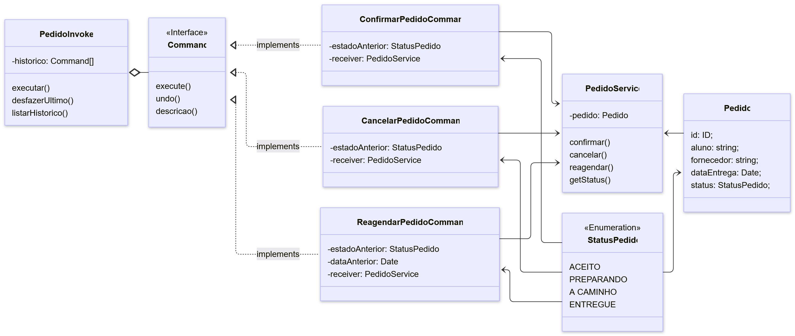

# GoF Comportamental - Command

O Command é um padrão de projeto comportamental que tem como objetivo encapsular uma solicitação como um objeto, permitindo que comandos possam ser executados, desfeitos, enfileirados ou registrados de maneira flexível.

Em outras palavras, o padrão transforma uma ação em um objeto independente, desacoplando o emissor (quem solicita a ação) do receptor (quem a executa).
Isso traz grande flexibilidade para sistemas que precisam de histórico de operações, filas de tarefas, macros, desfazer/refazer (undo/redo) ou integração com sistemas de execução remota (SERRANO, 2024).

---

## Intuito do Padrão

Segundo Serrano (2024), o Command serve para “controlar as chamadas a um determinado componente, modelando cada requisição como um objeto, e permitindo que as operações possam ser desfeitas ou registradas”.

Em essência, o padrão separa o pedido da sua execução, permitindo que diferentes ações sejam representadas por objetos distintos — cada um capaz de saber como executar e como desfazer sua própria operação.

---

## Estrutura Conceitual

O GoF Command envolve quatro papéis principais:

| Papel               | Descrição                                                                                                   |
| ------------------- | ----------------------------------------------------------------------------------------------------------- |
| **Command**         | Define a interface para executar e desfazer operações.                                                      |
| **ConcreteCommand** | Implementa a operação específica, ligando o comando a um *Receiver*.                                        |
| **Receiver**        | É o componente que realiza o trabalho real quando o comando é executado.                                    |
| **Invoker**         | É o solicitante da ação — o objeto que dispara o comando. Ele não sabe o que o comando faz, apenas o chama. |

Essa separação promove independência entre quem pede e quem executa a ação, facilitando a manutenção e a extensão do sistema (SERRANO, 2024).

---

## Benefícios

- Desacoplamento total entre quem solicita e quem executa a ação.

- Facilidade de extensão: novos comandos podem ser adicionados sem alterar o restante do sistema.

- Possibilidade de desfazer e refazer operações.

- Histórico e registro de ações, permitindo reprocessamento e auditoria.

- Filas de execução e integração com event sourcing ou message queues.

Essas características tornam o padrão especialmente útil em sistemas distribuídos, de automação ou com múltiplos pontos de controle (SERRANO, 2024).

---

## Quando Aplicar

O padrão Command é indicado quando:

- O sistema precisa desfazer/refazer ações do usuário.

- Há necessidade de filas de processamento ou reexecução de eventos.

- Deseja-se parametrizar objetos com diferentes solicitações ou ações configuráveis.

- É necessário desacoplar o emissor do executor, mantendo a flexibilidade de substituição ou extensão.

Em suma, o padrão é ideal para sistemas onde as ações precisam ser controladas, armazenadas e manipuladas de forma dinâmica (SERRANO, 2024).

---

## Aplicação no projeto

Com base no cenário de estudo proposto para esta disciplina, foi criado a seguinte estrutura de código para ilustrar a sua aplicação, levando em consideração o [Diagrama de Classes](https://unbarqdsw2025-2-turma01.github.io/2025.2-T01-G7_PodePedirFCTE_Entrega_02/#/./Modelagem/ModelagemEstatica/DiagramaDeClasses) da entrega 2.

---

### Diagrama de Classes

Para modelar o padrão de projeto, fizemos um diagrama de classes utilizando o [Mermaid Chart](https://www.mermaidchart.com/app/dashboard).

<!--  -->


---

### Command - PodePedirFCTE

Este exemplo simula o módulo de controle de pedidos, onde cada ação sobre o pedido (confirmar, cancelar, reagendar) é tratada como um objeto de comando independente, podendo ser executada, desfeita e registrada no histórico.

---

#### Estrutura de pastas

```json
podepedir-command/
  src/
    domain.ts
    command/
      command.ts
      concrete-commands.ts
      invoker.ts
    receiver/
      pedido-service.ts
    main.ts
  package.json
  tsconfig.json
```
---

#### 1) package.json
```json
{
  "name": "podepedir-command-demo",
  "version": "1.0.0",
  "type": "module",
  "scripts": {
    "start": "tsx src/main.ts",
    "dev": "tsx watch src/main.ts",
    "build": "tsc -p ."
  },
  "devDependencies": {
    "tsx": "^4.19.2",
    "typescript": "^5.6.3"
  }
}
```

---

#### 2) tsconfig.json

```json
{
  "compilerOptions": {
    "target": "ES2022",
    "module": "ES2022",
    "moduleResolution": "bundler",
    "strict": true,
    "esModuleInterop": true,
    "skipLibCheck": true,
    "outDir": "dist"
  },
  "include": ["src"]
}
```

---

#### 3) src/domain.ts
```TS
export type ID = string | number;

export enum StatusPedido {
  PENDENTE = "PENDENTE",
  CONFIRMADO = "CONFIRMADO",
  CANCELADO = "CANCELADO",
  REAGENDADO = "REAGENDADO",
}

export interface Pedido {
  id: ID;
  aluno: string;
  fornecedor: string;
  dataEntrega: Date;
  status: StatusPedido;
}
```

---

#### 4) src/receiver/pedido-service.ts

Receiver – responsável por executar o trabalho real.
```TS
import { Pedido, StatusPedido } from "../domain";

export class PedidoService {
  constructor(private pedido: Pedido) {}

  confirmar() {
    if (this.pedido.status === StatusPedido.CONFIRMADO) {
      console.log(`Pedido ${this.pedido.id} já está confirmado.`);
      return;
    }
    this.pedido.status = StatusPedido.CONFIRMADO;
    console.log(`✅ Pedido ${this.pedido.id} confirmado.`);
  }

  cancelar() {
    if (this.pedido.status === StatusPedido.CANCELADO) {
      console.log(`Pedido ${this.pedido.id} já está cancelado.`);
      return;
    }
    this.pedido.status = StatusPedido.CANCELADO;
    console.log(`🚫 Pedido ${this.pedido.id} cancelado.`);
  }

  reagendar(novaData: Date) {
    this.pedido.status = StatusPedido.REAGENDADO;
    this.pedido.dataEntrega = novaData;
    console.log(
      `📅 Pedido ${this.pedido.id} reagendado para ${novaData.toLocaleDateString()}.`
    );
  }

  getStatus() {
    return this.pedido.status;
  }
}
```

---

#### 5) src/command/command.ts

Command interface – define a estrutura de execução e desfazer.

```TS
export interface Command {
  execute(): void;
  undo(): void;
  descricao(): string;
}
```

---

#### 6) src/command/concrete-commands.ts

ConcreteCommand – cada comando encapsula uma ação do PedidoService.

```TS
import { Command } from "./command";
import { PedidoService } from "../receiver/pedido-service";
import { StatusPedido } from "../domain";

export class ConfirmarPedidoCommand implements Command {
  private estadoAnterior: StatusPedido | null = null;
  constructor(private receiver: PedidoService) {}

  execute() {
    this.estadoAnterior = this.receiver.getStatus();
    this.receiver.confirmar();
  }

  undo() {
    if (this.estadoAnterior) {
      console.log(`↩️ Desfazendo confirmação...`);
      if (this.estadoAnterior === StatusPedido.PENDENTE)
        console.log(`Pedido voltou para PENDENTE.`);
    }
  }

  descricao() {
    return "Confirmar Pedido";
  }
}

export class CancelarPedidoCommand implements Command {
  private estadoAnterior: StatusPedido | null = null;
  constructor(private receiver: PedidoService) {}

  execute() {
    this.estadoAnterior = this.receiver.getStatus();
    this.receiver.cancelar();
  }

  undo() {
    if (this.estadoAnterior) {
      console.log(`↩️ Revertendo cancelamento...`);
      if (this.estadoAnterior === StatusPedido.PENDENTE)
        console.log(`Pedido voltou para PENDENTE.`);
    }
  }

  descricao() {
    return "Cancelar Pedido";
  }
}

export class ReagendarPedidoCommand implements Command {
  private estadoAnterior: StatusPedido | null = null;
  private dataAnterior: Date | null = null;

  constructor(private receiver: PedidoService, private novaData: Date) {}

  execute() {
    this.estadoAnterior = this.receiver.getStatus();
    this.dataAnterior = new Date();
    this.receiver.reagendar(this.novaData);
  }

  undo() {
    if (this.estadoAnterior && this.dataAnterior) {
      console.log(`↩️ Desfazendo reagendamento...`);
      console.log(`Pedido voltaria à data anterior: ${this.dataAnterior}`);
    }
  }

  descricao() {
    return "Reagendar Pedido";
  }
}
```

---

#### 7) src/command/invoker.ts

Invoker – solicita a execução e mantém o histórico.

```TS
import { Command } from "./command";

export class PedidoInvoker {
  private historico: Command[] = [];

  executar(cmd: Command) {
    console.log(`\n[Executando comando: ${cmd.descricao()}]`);
    cmd.execute();
    this.historico.push(cmd);
  }

  desfazerUltimo() {
    const cmd = this.historico.pop();
    if (!cmd) {
      console.log("Nenhum comando para desfazer.");
      return;
    }
    console.log(`\n[Desfazendo comando: ${cmd.descricao()}]`);
    cmd.undo();
  }

  listarHistorico() {
    console.log("\n=== Histórico de comandos ===");
    this.historico.forEach((c, i) =>
      console.log(`${i + 1}. ${c.descricao()}`)
    );
  }
}
```

---

#### 8) src/main.ts

Simulação prática do padrão Command.

```TS
import { Pedido, StatusPedido } from "./domain";
import { PedidoService } from "./receiver/pedido-service";
import {
  ConfirmarPedidoCommand,
  CancelarPedidoCommand,
  ReagendarPedidoCommand,
} from "./command/concrete-commands";
import { PedidoInvoker } from "./command/invoker";

const pedido: Pedido = {
  id: "PED-2025-001",
  aluno: "Lucas Almeida",
  fornecedor: "Cantina FCTE",
  dataEntrega: new Date("2025-10-25"),
  status: StatusPedido.PENDENTE,
};

const service = new PedidoService(pedido);
const invoker = new PedidoInvoker();

// Criação dos comandos
const cmdConfirmar = new ConfirmarPedidoCommand(service);
const cmdReagendar = new ReagendarPedidoCommand(service, new Date("2025-10-28"));
const cmdCancelar = new CancelarPedidoCommand(service);

// Execução sequencial
invoker.executar(cmdConfirmar);
invoker.executar(cmdReagendar);
invoker.executar(cmdCancelar);

// Histórico e desfazer
invoker.listarHistorico();
invoker.desfazerUltimo();
```

---
### Saída esperada

Ao executar o código acima, a saída que se espera visualizar no terminal é:
``` 
[Executando comando: Confirmar Pedido]
✅ Pedido PED-2025-001 confirmado.

[Executando comando: Reagendar Pedido]
📅 Pedido PED-2025-001 reagendado para 27/10/2025.

[Executando comando: Cancelar Pedido]
🚫 Pedido PED-2025-001 cancelado.

=== Histórico de comandos ===
1. Confirmar Pedido
2. Reagendar Pedido
3. Cancelar Pedido

[Desfazendo comando: Cancelar Pedido]
↩️ Revertendo cancelamento...
```

---

## Quadro de Participações

| **Membro da equipe** | **Função** |
| :------------- | :--------- |
| [Ana Clara](https://github.com/anabborges) | Criação do Diagrama de Classes |
| [Guilherme Storch](https://github.com/storch7) | Documentação e Implementação do padrão  |

## Referências

> SERRANO, Milene. Arquitetura e Desenho de Software – Aula GoFs Comportamentais. Universidade de Brasília, 2024. Material didático apresentado na disciplina de Arquitetura e Desenho de Software – Padrões GoF Comportamentais.

---

### Execução

O arquivo a seguir contém o código executável com a estrutura acima abordada. [Link para download.](https://drive.google.com/file/d/1uOaw5QBZIMmQ7B_pt3t8iv99rdFE3Hk4/view?usp=sharing)

O código acima foi desenvolvido em TypeScript, com a verão.
- Node JS na versão: `v22.14.0`


Executar os comandos abaixo, na pasta raiz do projeto:
- `npm i` -> instala as dependências para execução do código
- `npm run start` -> executa o código desenvolvido

---

## Histórico de Versões

| **Data**       | **Versão** | **Descrição**                         | **Autor**                                      | **Revisor**                                      | **Data da Revisão** |
| :--------: | :----: | :-------------------------------- | :----------------------------------------: | :----------------------------------------: | :-------------: |
| 22/10/2025 |  `1.0`   | Criação da página. | [`@storch7`](https://github.com/storch7) | [`@Ana Joyce`](https://github.com/anajoyceamorim) |   24/10/2025    |
| 24/10/2025 |  `1.0`   | Adicionando o arquivo executável | [`@storch7`](https://github.com/storch7) | [`@Ana Joyce`](https://github.com/anajoyceamorim) |   24/10/2025    |
| 24/10/2025 |  `1.1`   | Adiciona o diagrama de classes | [`@Ana Clara`](https://github.com/anabborges) | [`@storch7`](https://github.com/storch7) |   24/10/2025    |