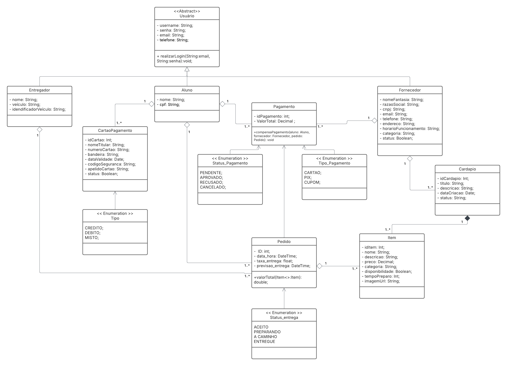

# Chain of Responsibility

## Introdução

Esse documento apresenta explicações referentes ao padrão de projeto Chain of Responsibility (Cadeia de Responsabilidade) e detalha como ele foi utilizado dentro do projeto Pode Pedir FCTE.

O padrão Chain of Responsibility evita acoplar o remetente de uma solicitação ao seu destinatário, dando a mais de um objeto a chance de processar a solicitação. Com isso, são encadeados os objetos receptores e a solicitação é passada ao longo da cadeia até que um objeto a processe.

No contexto do projeto **Pode Pedir FCTE**, uma plataforma de delivery para estabelecimentos próximos à FCTE, o padrão Chain of Responsibility foi aplicado ao fluxo de processamento de pagamentos. Este fluxo envolve múltiplas etapas de validação e autorização que precisam ser executadas sequencialmente, mas sem criar forte acoplamento entre os diferentes componentes do sistema.


## Chain of Responsibility

O padrão Chain of Responsibility é apresentado no livro *Design Patterns: Elements of Reusable Object-Oriented Software* como um **padrão comportamental de objetos**. Segundo Gamma et al. (1995, p. 212), este padrão tem como intenção:

> "Evitar o acoplamento do remetente de uma solicitação ao seu receptor, ao dar a mais de um objeto a oportunidade de tratar a solicitação. Encadear os objetos receptores, passando a solicitação ao longo da cadeia até que um objeto a trate."

### Motivação

O exemplo motivacional clássico apresentado por Gamma et al. (1995, p. 212-213) é um recurso de *help* sensível ao contexto para interfaces gráficas. O usuário pode obter informação de ajuda em qualquer parte da interface simplesmente pressionando o botão do mouse sobre ela, e a ajuda fornecida depende da parte selecionada e do seu contexto.

O problema fundamental é que "o objeto que na prática fornece a ajuda não é conhecido explicitamente pelo objeto (por exemplo, o botão) que inicia a solicitação de ajuda" (GAMMA et al., 1995, p. 212). A solução proposta pelo padrão é desacoplar remetentes e receptores, permitindo que múltiplos objetos tenham a oportunidade de tratar uma solicitação ao longo de uma cadeia.

O padrão é particularmente útil em cenários de **pipeline de processamento**, onde cada etapa realiza uma função específica e pode determinar se a requisição deve continuar pela cadeia ou ser interrompida.

### Aplicabilidade

O padrão Chain of Responsibility deve ser aplicado quando (GAMMA et al., 1995, p. 214):

- Mais de um objeto pode tratar uma solicitação, e o objeto que a tratará não é conhecido *a priori*, devendo ser escolhido automaticamente.
- Você quer emitir uma solicitação para um dentre vários objetos, sem especificar explicitamente o receptor.
- O conjunto de objetos que pode tratar uma solicitação deveria ser especificado dinamicamente, permitindo flexibilidade na composição da cadeia.

### Estrutura e Participantes

O padrão é composto pelos seguintes participantes (GAMMA et al., 1995, p. 214-215):

* **Handler (Processador):** Define uma interface para tratar solicitações e (opcionalmente) implementa o elo (*link*) ao sucessor.

* **ConcreteHandler (Processador Concreto):** Trata de solicitações pelas quais é responsável. Pode acessar seu sucessor. Se puder tratar a solicitação, ele o faz; caso contrário, repassa-a ao sucessor.

* **Client (Cliente):** Inicia a solicitação para um objeto ConcreteHandler da cadeia.

#### Colaborações

Quando um cliente emite uma solicitação, ela se propaga ao longo da cadeia até que um ConcreteHandler assuma a responsabilidade de tratá-la.

### Vantagens

**1. Acoplamento reduzido:** O padrão "libera um objeto de ter que conhecer qual o outro objeto que trata de uma solicitação" (GAMMA et al., 1995, p. 215). Um objeto precisa saber apenas que a solicitação será tratada "apropriadamente", sem que remetente e receptor tenham conhecimento explícito um do outro. Como resultado, o padrão simplifica as interconexões: ao invés de manter referências para todos os receptores-candidatos, os objetos mantêm apenas uma referência ao sucessor.

**2. Flexibilidade adicional na atribuição de responsabilidades:** O padrão proporciona flexibilidade na distribuição de responsabilidades, pois "é possível acrescentar ou mudar responsabilidades para o tratamento de uma solicitação pelo acréscimo ou mudança da cadeia em tempo de execução" (GAMMA et al., 1995, p. 215). Isso pode ser combinado com subclasses para especializar estaticamente os *handlers*.

**3. Controle da ordem de processamento:** Alterando a ordem dos handlers na cadeia, é possível reorganizar todo o fluxo de processamento sem alterar as classes individuais (REFACTORING GURU, 2025).

**4. Princípio da responsabilidade única:** Você pode desacoplar classes que invocam operações de classes que realizam operações, mantendo cada handler focado em uma única responsabilidade (REFACTORING GURU, 2025).

**5. Princípio aberto/fechado:** Você pode introduzir novos handlers na aplicação sem quebrar o código cliente existente (REFACTORING GURU, 2025).

### Desvantagens

**1. A recepção não é garantida:** Como "uma solicitação não tem um receptor explícito, não há garantia de que ela será tratada – a solicitação pode sair pelo final da cadeia sem ter sido tratada" (GAMMA et al., 1995, p. 215). Isso pode ocorrer especialmente quando a cadeia não está configurada apropriadamente.

**2. Dificuldade de observação das características de tempo de execução:** Pode ser difícil observar e depurar o comportamento em tempo de execução, especialmente em cadeias longas ou complexas, tornando o rastreamento do fluxo mais desafiador.

### Aspectos de Implementação

Aspectos importantes a serem considerados ao implementar o padrão (GAMMA et al., 1995, p. 215-217):

**1. Implementando a cadeia de sucessores:** Há duas maneiras possíveis:
   - **(a) Definir novos elos** - normalmente no Handler, porém os ConcreteHandlers também podem defini-las;
   - **(b) Utilizar elos existentes** - aproveitar referências já existentes, como as referências aos pais numa hierarquia partes-todo.

**2. Conectando sucessores:** Quando não existem referências pré-existentes, o handler mantém a ligação para o sucessor, permitindo fornecer uma implementação-padrão de HandleRequest que repassa a solicitação automaticamente.

**3. Representando solicitações:** Diferentes opções estão disponíveis:
   - **Forma simples:** Invocação de uma operação codificada de maneira rígida (como HandleHelp). É conveniente e seguro, mas limitado ao conjunto fixo de solicitações definido pela classe handler.
   - **Função handler com código:** Uma única função que aceita um código de solicitação como parâmetro. Mais flexível e suporta um conjunto aberto de solicitações, mas requer comandos condicionais para despacho.
   - **Objetos-solicitação separados:** Uma classe Request que "empacota" os parâmetros da solicitação, permitindo definir novos tipos por subclasses.

### Usos Conhecidos

Diversas bibliotecas e frameworks utilizam o padrão:

- **MacApp e ET++:** Tratam eventos de usuário com a classe handler chamada "Event-Handler".
- **Biblioteca TCL da Symantec:** Usa o termo "Bureaucrat" para a classe handler.
- **AppKit do NeXT:** Adota o nome "Responder" para representar handlers.
- **Framework Unidraw:** Define objetos Command que encapsulam solicitações para Components, que podem repassar a interpretação de comandos hierarquicamente aos seus pais.
- **ET++:** Aplica o padrão para atualizações gráficas através da operação InvalidateRct, que repassa solicitações pela cadeia até Window.

### Padrões Relacionados

O Chain of Responsibility é frequentemente aplicado em conjunto com o padrão **Composite**, onde o pai de um componente pode atuar como seu sucessor na cadeia.

## Aplicação no projeto

Para a implementação do **GOF Comportamental Chain of Responsibility** foi escolhido trabalhar com o fluxo de processamento de **Pagamentos** do diagrama de classes original do projeto Pode Pedir FCTE.


<p align="center"><i>Figura 1: Diagrama de Classes do Projeto Pode Pedir FCTE - Contexto de Domínio</i></p>

### Justificativa da Escolha

O fluxo de pagamento foi escolhido por representar um cenário real onde múltiplas etapas de validação e processamento precisam ocorrer de forma sequencial e desacoplada. No contexto de uma plataforma de delivery, um pagamento precisa passar por diferentes verificações antes de ser aprovado:

1. **Validação Interna** - Verificação de dados básicos do pagamento
2. **Sistema Anti-Fraude** - Análise de padrões suspeitos e limites de segurança
3. **Gateway de Pagamento** - Autorização junto à operadora financeira
4. **Notificação** - Comunicação do resultado para as partes interessadas (Aluno e Fornecedor)

Cada uma dessas etapas pode **aprovar e encaminhar** a requisição para a próxima fase, ou **rejeitar e interromper** o processamento. Esta característica torna o Chain of Responsibility ideal para esse cenário.


<p align="center"><i>Figura 2: Diagrama UML do Padrão Chain of Responsibility Aplicado ao Processamento de Pagamentos</i></p>

### Ferramentas e Tecnologias Utilizadas

Para a construção desta implementação foram utilizadas as seguintes ferramentas:

- **Linguagem de Programação:** Java (versão orientada a objetos)
- **IDE:** Eclipse IDE for Java Developers
- **Ferramenta de Modelagem:** Astah UML para criação dos diagramas de classes
- **Controle de Versão:** Git/GitHub para versionamento do código e documentação

### Insights e Discussões

**Flexibilidade vs. Complexidade:** A implementação trouxe grande flexibilidade ao sistema, permitindo adicionar ou remover etapas de validação sem impactar o código cliente. Conforme destaca a literatura, esta flexibilidade permite "acrescentar ou mudar responsabilidades para o tratamento de uma solicitação pelo acréscimo ou mudança da cadeia em tempo de execução" (GAMMA et al., 1995, p. 215). No entanto, identificou-se que cadeias muito longas podem dificultar o rastreamento e debug do fluxo, corroborando as deficiências mencionadas sobre dificuldades de observação em tempo de execução.

**Decisão de Design - Interrupção da Cadeia:** Optou-se por permitir que handlers intermediários interrompam a cadeia ao rejeitar um pagamento, evitando processamento desnecessário. Um pagamento com valor negativo, por exemplo, não precisa passar pela verificação de fraude ou gateway. Esta decisão está alinhada com o conceito de que "o primeiro objeto na cadeia que recebe a solicitação trata a mesma ou a repassa para o próximo candidato" (GAMMA et al., 1995, p. 213).

**Implementação da Cadeia de Sucessores:** Foi adotada a abordagem de **definir novos elos** (GAMMA et al., 1995, p. 215-216) na classe `ProcessadorDePagamentoHandler`, que mantém explicitamente a referência ao sucessor através do atributo `nextHandler` e do método `setNext()`. Esta escolha se justifica pela ausência de referências pré-existentes adequadas no domínio do problema.

**Representação de Solicitações:** Optou-se pela **operação codificada de maneira rígida** (`handle(Pagamento pagamento)`), que é "conveniente e seguro" (GAMMA et al., 1995, p. 216), embora limitado ao conjunto fixo de solicitações definido pela classe handler. Para o contexto específico de processamento de pagamentos, esta limitação não representa problema, pois o fluxo de validação é bem definido e estável.

**Separação de Responsabilidades:** Cada handler tem uma responsabilidade clara e única. Por exemplo, o `ValidadorInternoHandler` verifica apenas dados básicos, enquanto o `SistemaAntiFraudeHandler` foca exclusivamente em padrões de fraude. Esta separação reflete o princípio de que cada ConcreteHandler "trata de solicitações pelas quais é responsável" (GAMMA et al., 1995, p. 215), facilitando manutenção e testes unitários.

**Estado Mutável do Pagamento:** A classe `Pagamento` atua como um objeto de contexto que atravessa toda a cadeia, acumulando mudanças de estado (`StatusPagamento`) e permitindo que handlers posteriores tomem decisões baseadas em processamentos anteriores. Esta abordagem se assemelha aos "objetos-solicitação" (GAMMA et al., 1995, p. 217), onde uma classe encapsula parâmetros e estado da solicitação.


### Classe Serviço de Pagamento

**Nota:** Essa classe é o cliente que usa o handler, e ela que contém a corrente com a ordem dos handlers que serão utilizados.

```
package Chain;

public class ServicoDePagamento {
	
	private ProcessadorDePagamentoHandler chain;
	
	public ServicoDePagamento() {
		
		ProcessadorDePagamentoHandler validador = new ValidadorInternoHandler();
		ProcessadorDePagamentoHandler antifraude = new SistemaAntiFraudeHandler();
		ProcessadorDePagamentoHandler gateway = new GatewayDePagamentoHandler();
		ProcessadorDePagamentoHandler notificador = new NotificacaoHandler();
		
		validador.setNext(antifraude);
		antifraude.setNext(gateway);
		gateway.setNext(notificador);
		
		this.chain = validador;
		
	}
	
	public Pagamento processarPagamento (Pagamento pagamento) {
		
		System.out.println("Iniciando novo processamento para o pagamento de id: " + pagamento.getIdPagamento());
		
		this.chain.handle(pagamento);
		
		System.out.println("Processamento finalizado.");
		System.out.println("Resultado final: " + pagamento.getStatusPagamento());
		
		return pagamento;
		
	}

}
```

### Classe ProcessadorDePagamentoHandler

**Nota:** Essa é a classe mãe responsável por implementar o método handle que será utilizado pelas classes filhas quando elas acabarem a sua função e quiserem chamar o próximo método de verificação.

```
package Chain;

public abstract class ProcessadorDePagamentoHandler {
	
	protected ProcessadorDePagamentoHandler nextHandler;
	
	public void setNext(ProcessadorDePagamentoHandler nextHandler) {
		this.nextHandler = nextHandler;
	}
	
	public void handle(Pagamento pagamento) {
		if (this.nextHandler != null) {
			this.nextHandler.handle(pagamento);
		}
	}
}
```

### Classe ValidadorInterno (Primeiro handler da corrente)

```
package Chain;

public class ValidadorInternoHandler extends ProcessadorDePagamentoHandler {

	@Override
	public void handle(Pagamento pagamento) {
		System.out.println("Passando pelo handler: Validador Interno...");
		
		if (pagamento.getValorTotal() <= 0.0) {
			System.out.println("Erro encontrado no valor do pagamento, encerrando operação");
			pagamento.setStatusPagamento(StatusPagamento.REJEITADO);
		} else {
			System.out.println("Nenhum problema encontrado no validador interno, passando para o próximo hanlder...");
			super.handle(pagamento);
		}
	}
}
```

### Classe SistemaAntiFraude (Segundo handler da corrente)

```
package Chain;

public class SistemaAntiFraudeHandler extends ProcessadorDePagamentoHandler{
	
	private double limiteFraude = 5000.0;
	
	@Override
	public void handle(Pagamento pagamento) {
		System.out.println("Passando pelo handler: Sistema Anti-fraude...");
		
		if (pagamento.getValorTotal() > this.limiteFraude) {
			System.out.println("Alerta ! Pagamento acima do limite de fraude. Encerrando operação.");
			pagamento.setStatusPagamento(StatusPagamento.REJEITADO);
		} else {
			System.out.println("Nenhuma fraude encontrada, passando para o próximo hanlder...");
			super.handle(pagamento);
		}
	}

}
```

### Classe GatewayDePagamento (Terceiro handler da corrente)

```
package Chain;

public class GatewayDePagamentoHandler extends ProcessadorDePagamentoHandler{
	
	@Override
	public void handle(Pagamento pagamento) {
		System.out.println("Passando pelo handler: Gateway de Pagamento...");
		
		// Supondo que qualquer cobrança acima de 1000 reais seja rejeitada
		boolean sucesso = (pagamento.getValorTotal() <= 1000);
		
		if (sucesso) {
			System.out.println("Sucesso, Gateway autorizou o pagamento. Passando para o próximo handler");
			pagamento.setStatusPagamento(StatusPagamento.APROVADO);
		} else {
			System.out.println("Falha, Gateway não autorizou o pagamento. Encerrando operação.");
			pagamento.setStatusPagamento(StatusPagamento.REJEITADO);
		}
		super.handle(pagamento);
	}
}
```

### Classe Notificação (Quarto e último handler da corrente)

```
package Chain;

public class NotificacaoHandler extends ProcessadorDePagamentoHandler {
	
	@Override
	public void handle(Pagamento pagamento) {
		System.out.println("Passando pelo handler: Notificacao...");
		
		if (pagamento.getStatusPagamento() == StatusPagamento.APROVADO) {
			System.out.println("Pagamento aprovado. Enviando notificação para o aluno e para o fornecedor.");
		} else {
			System.out.println("Pagamento rejeitado. Encerrando operação.");
		}
	}
}
```

### Enum StatusPagamento 

```
package Chain;

public enum StatusPagamento {
    PENDENTE,
    APROVADO,
    REJEITADO,
    CANCELADO
}
```

### Classe Pagamento

```
package Chain;

public class Pagamento {

		private int idPagamento;
		private double valorTotal;
		private StatusPagamento status;
		
		public Pagamento(int idPagamento, double valorTotal) {
			this.idPagamento = idPagamento;
			this.valorTotal = valorTotal;
			this.status = StatusPagamento.PENDENTE;
			
		}
		
		public int getIdPagamento() {
			return idPagamento;
		}
		
		public double getValorTotal() {
			return valorTotal;
		}
		
		public StatusPagamento getStatusPagamento() {
			return status;
		}
		
		public void setStatusPagamento (StatusPagamento status) {
			this.status = status;
		}
}
```

### Classe de Testes

Com base em todos os blocos de código desenvolvidos até agora é possível criar uma classe responsável por juntar todas essas classes para que o código seja testado.

```
package Chain;

public class Testes {

	public static void main(String[] args) {
		
		ServicoDePagamento servico = new ServicoDePagamento();
		
		//  Teste 1: Pagamento Aprovado
        System.out.println("--- TESTE 1: APROVADO (R$ 250.00) ---");
        Pagamento pag1 = new Pagamento(101, 250.00);
        servico.processarPagamento(pag1);
        
        // Teste 2: Rejeitado no Handler Validador
        System.out.println("\n--- TESTE 2: REJEITADO NO VALIDADOR (R$ -50.00) ---");
        Pagamento pag2 = new Pagamento(102, -50.00);
        servico.processarPagamento(pag2);
        
        // Teste 3: Rejeitado no Handler Anti-Fraude
        System.out.println("\n--- TESTE 3: REJEITADO NO ANTI-FRAUDE (R$ 7000.00) ---");
        Pagamento pag3 = new Pagamento(103, 7000.00);
        servico.processarPagamento(pag3);
        
        // --- Teste 4: Rejeitado no Handler Gateway
        System.out.println("\n--- TESTE 4: REJEITADO NO GATEWAY (R$ 1500.00) ---");
        Pagamento pag4 = new Pagamento(104, 1500.00);
        servico.processarPagamento(pag4);

	}
}
```

## Explicação do Padrão em Vídeo

Para garantir uma melhor explicação de como o GOF foi aplicado no desenvolvimento do projeto Pode Pedir FCTE, foi feito também um vídeo contendo além da explicação o funcionamento do código desenvolvido.

<iframe width="560" height="315" src="https://www.youtube.com/embed/JxK98VUAXTk?si=LFM9HKulR1Dgtc53" title="YouTube video player" frameborder="0" allow="accelerometer; autoplay; clipboard-write; encrypted-media; gyroscope; picture-in-picture; web-share" referrerpolicy="strict-origin-when-cross-origin" allowfullscreen></iframe>

## Correlação com Entregas Anteriores

Esta seção estabelece as conexões entre o padrão Chain of Responsibility implementado nesta entrega e os artefatos produzidos nas entregas anteriores do projeto Pode Pedir FCTE.

### Relação com a Entrega 01 - Base e Requisitos

O padrão Chain of Responsibility dialoga diretamente com o domínio estabelecido na [Entrega 01](https://github.com/UnBArqDsw2025-2-Turma01/2025.2-T01-G7_PodePedirFCTE_Entrega_01), onde foram definidos os conceitos fundamentais do sistema de delivery:

- **Atores do Sistema:** A classe `Pagamento` conecta os atores Aluno (cliente) e Fornecedor (estabelecimento), que foram identificados na modelagem inicial do projeto.
- **Fluxo de Negócio:** O processamento sequencial de pagamentos reflete o fluxo de negócio onde um pedido precisa ter seu pagamento validado antes da confirmação junto ao fornecedor.
- **Requisitos Não-Funcionais:** A implementação em cadeia atende requisitos de segurança (validação anti-fraude) e confiabilidade (múltiplas camadas de verificação) que foram elicitados na fase inicial.

### Relação com a Entrega 02 - Modelagem e Notação UML

O padrão implementado se baseia e estende o [Diagrama de Classes](https://unbarqdsw2025-2-turma01.github.io/2025.2-T01-G7_PodePedirFCTE_Entrega_02/#/./Modelagem/ModelagemEstatica/DiagramaDeClasses) desenvolvido na [Entrega 02](https://github.com/UnBArqDsw2025-2-Turma01/2025.2-T01-G7_PodePedirFCTE_Entrega_02):

- **Classe Pagamento:** Originalmente modelada com atributos `idPagamento` e `valorTotal`, foi enriquecida com o enum `StatusPagamento` para suportar o fluxo de estados da cadeia de responsabilidade.
- **Relacionamentos:** O relacionamento entre `Aluno`, `Pagamento` e `Fornecedor` (visível na Figura 1) evidencia que o processamento de pagamentos é central no fluxo de pedidos da plataforma.
- **Evolução Arquitetural:** Enquanto a Entrega 02 focou na modelagem estática do domínio, esta entrega introduz a **modelagem comportamental**, mostrando como os objetos colaboram dinamicamente no processamento de pagamentos.

### Extensibilidade para Futuras Entregas

A estrutura em Chain of Responsibility permite evoluções futuras, como:

- **Integração com padrões Criacionais:** Utilizar Factory ou Builder para criar diferentes configurações de cadeias de pagamento (ex: processamento expresso, processamento com análise estendida).
- **Integração com padrões Estruturais:** Aplicar Decorator para adicionar funcionalidades extras aos handlers (ex: logging, cache de validações).
- **Observabilidade:** Implementar o padrão Observer para notificar diferentes partes do sistema sobre o progresso do pagamento em cada etapa da cadeia.

## Quadro de Participações

| **Membro da equipe** | **Função** |
| :------------- | :--------- |
| [Luiz](https://github.com/luizfaria1989) | Documentação da página, criação do diagrama, dos blocos de código e criação do vídeo explicativo. |
| [Gabriela](https://github.com/gaubiela) | Documentação da página, validação do diagrama e código. |

## Referências

> GAMMA, Erich; HELM, Richard; JOHNSON, Ralph; VLISSIDES, John. **Padrões de Projetos: Soluções Reutilizáveis de Software Orientados a Objetos**. Porto Alegre: Bookman, 2000. Tradução de Luiz A. Meirelles Salgado. Título original: *Design Patterns: Elements of Reusable Object-Oriented Software*. Capítulo 5: Padrões Comportamentais - Chain of Responsibility, p. 212-221.

> REFACTORING GURU. **Chain of Responsibility**. 2025. Disponível em: https://refactoring.guru/design-patterns/chain-of-responsibility. Acesso em: 23 out. 2025.

> PODE PEDIR FCTE. **Entrega 01 - Base e Requisitos**. Repositório do Projeto. Disponível em: https://github.com/UnBArqDsw2025-2-Turma01/2025.2-T01-G7_PodePedirFCTE_Entrega_01. Acesso em: 23 out. 2025.

> PODE PEDIR FCTE. **Entrega 02 - Modelagem e Notação UML**. Repositório do Projeto. Disponível em: https://github.com/UnBArqDsw2025-2-Turma01/2025.2-T01-G7_PodePedirFCTE_Entrega_02. Acesso em: 23 out. 2025.

## Histórico de Versões

| **Data**       | **Versão** | **Descrição**                         | **Autor**                                      | **Revisor**                                      | **Data da Revisão** |
| :--------: | :----: | :-------------------------------- | :----------------------------------------: | :----------------------------------------: | :-------------: |
| 23/10/2025 |  `0.3`   | Adição do vídeo explicativo. | [`@Luiz`](https://github.com/luizfaria1989) | [`@`](https://github.com/) |   00/00/0000    |
| 23/10/2025 |  `0.2`   | Complementação da documentação. | [`@Gabriela`](https://github.com/gaubiela) | [`@Luiz`](https://github.com/luizfaria1989) |   23/10/2025    |
| 23/10/2025 |  `0.1`   | Criação da página, dos blocos de código e diagrama. | [`@Luiz`](https://github.com/luizfaria1989) | [`@Gabriela`](https://github.com/gaubiela) |   23/10/2025    |