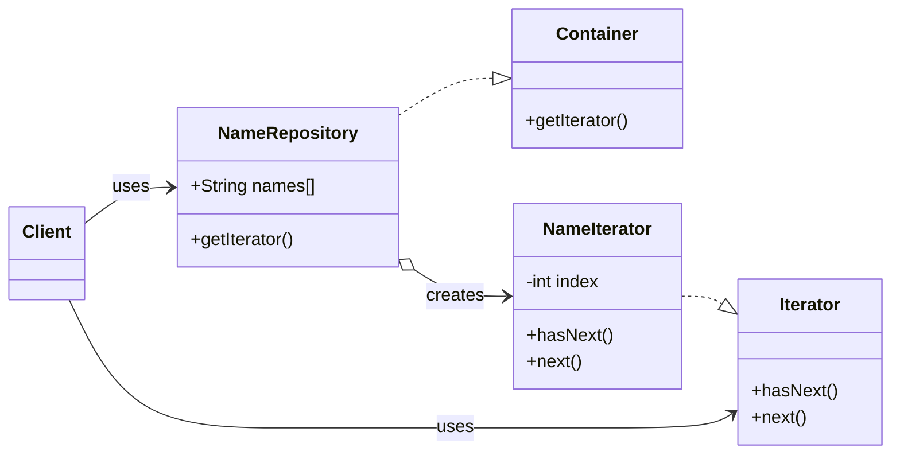

# 3.3.2. Iterator

O padrão **Iterator** (Iterador) é um padrão de projeto comportamental que fornece uma maneira de acessar os elementos de um objeto agregado (uma coleção) sequencialmente, sem expor sua representação interna. Ele transfere a responsabilidade de percorrer e acessar os elementos de uma coleção para um objeto iterador.

## 1. Contexto no Projeto "PodePedir!"

No sistema **[PodePedir!](/Projeto/Projeto.md)**, teremos diversas coleções de dados: a lista de itens em um pedido, o cardápio (uma coleção de pratos), a lista de mesas ocupadas, etc. O padrão Iterator nos permite criar algoritmos que percorrem essas listas de maneira uniforme.

Por exemplo, para gerar a conta de uma mesa, precisamos somar o preço de todos os itens pedidos. Usando um iterador, o módulo de faturamento pode percorrer a coleção de itens do pedido e calcular o total, sem precisar saber se a coleção é um `Array`, uma `List` ou outra estrutura de dados customizada. Isso está diretamente relacionado às entidades definidas em nosso **[Diagrama de Classes](/Modelagem/ModelagemEstatica/DiagramaDeClasses.md)**, onde um `Pedido` contém uma coleção de `ItemPedido`.

## 2. Estrutura

O padrão é formado por quatro componentes principais:

- **Iterator:** A interface que define os métodos para a navegação, como `hasNext()` (verifica se há um próximo elemento) e `next()` (retorna o próximo elemento).
- **ConcreteIterator:** A implementação concreta do `Iterator`. Mantém o controle da posição atual na travessia da coleção.
- **Container (ou Aggregate):** A interface que define um método para criar um `Iterator`.
- **ConcreteContainer (ou ConcreteAggregate):** A implementação concreta do `Container`. É a classe da coleção que será percorrida e instancia um `ConcreteIterator` correspondente.

O diagrama abaixo, baseado no material de referência, ilustra essa estrutura:



## 3. Exemplo de Implementação

O exemplo a seguir, baseado no material da disciplina, demonstra como um cliente pode percorrer uma coleção de nomes (`NameRepository`) usando um iterador.

### 3.1. Interfaces `Iterator` e `Container`

Primeiro, definimos as abstrações para o iterador e para a coleção que o fornecerá.

```java
// Arquivo: Iterator.java
public interface Iterator {
   public boolean hasNext();
   public Object next();
}

// Arquivo: Container.java
public interface Container {
   public Iterator getIterator();
}
```

### 3.2. Implementação Concreta

A classe `NameRepository` é a nossa coleção e contém uma classe interna (`NameIterator`) que sabe como percorrer o array de nomes.

```java
// Arquivo: NameRepository.java
public class NameRepository implements Container {
   public String names[] = {"Robert" , "John" ,"Julie" , "Lora"};

   @Override
   public Iterator getIterator() {
      return new NameIterator();
   }

   private class NameIterator implements Iterator {

      int index;

      @Override
      public boolean hasNext() {
         if(index < names.length){
            return true;
         }
         return false;
      }

      @Override
      public Object next() {
         if(this.hasNext()){
            return names[index++];
         }
         return null;
      }		
   }
}
```

### 3.3. Cliente

O cliente obtém o iterador a partir do repositório e o utiliza para percorrer a coleção, sem conhecer a estrutura interna (neste caso, um array).

```java
// Arquivo: IteratorPatternDemo.java
public class IteratorPatternDemo {
	
   public static void main(String[] args) {
      NameRepository namesRepository = new NameRepository();

      for(Iterator iter = namesRepository.getIterator(); iter.hasNext();){
         String name = (String)iter.next();
         System.out.println("Name : " + name);
      } 	
   }
}
```

**Saída:**
```
Name : Robert
Name : John
Name : Julie
Name : Lora
```

## 4. Referências

- TUTORIALSPOINT. **Iterator Design Pattern**. Disponível em: [https://www.tutorialspoint.com/design_pattern/iterator_pattern.htm](https://www.tutorialspoint.com/design_pattern/iterator_pattern.htm). Acesso em: 24 de out. de 2025.
- SOURCEMAKING. **Iterator Design Pattern**. Disponível em: [https://sourcemaking.com/design_patterns/iterator](https://sourcemaking.com/design_patterns/iterator). Acesso em: 24 de out. de 2025.

## Histórico de Versões

| **Data**       | **Versão** | **Descrição**                      | **Autor**                                     | **Revisor** | **Data da Revisão** |
| :--------: | :----: | :--------------------------------- | :---------------------------------------: | :---------: | :-------------: |
| 24/10/2025 |  `1.0`   | Criação do artefato do Iterator.   | [Ana Joyce](https://github.com/anajoyceamorim) |             |                 |
