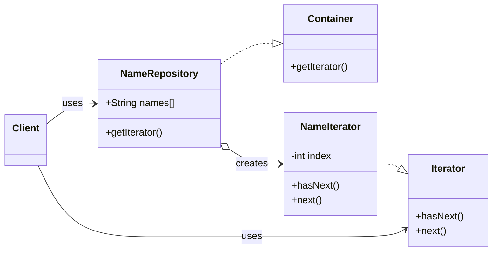

# 3.3.2. Iterator

O padrão **Iterator** (Iterador) é um padrão de projeto comportamental que fornece uma maneira de acessar os elementos de um objeto agregado (uma coleção) sequencialmente, sem expor sua representação interna. Ele transfere a responsabilidade de percorrer e acessar os elementos de uma coleção para um objeto iterador.

## 1. Contexto no Projeto "PodePedirFCTE"

No aplicativo **PodePedirFCTE**, lidamos constantemente com listas de objetos: a lista de restaurantes disponíveis, o cardápio de um restaurante (uma lista de pratos), e os itens dentro de um carrinho de compras. O padrão **Iterator** é ideal para percorrer essas listas de forma padronizada, sem que o código que as utiliza precise saber como elas foram implementadas.

**Exemplo Prático 1: Exibir Restaurantes**

Imagine que a tela principal do aplicativo precisa exibir todos os restaurantes abertos. Esses restaurantes podem estar armazenados em um vetor, uma lista ligada, ou até mesmo em uma estrutura de dados mais complexa que otimiza a busca por proximidade.

Com o padrão Iterator, o módulo de UI (Interface do Usuário) não precisa se preocupar com esses detalhes. Ele simplesmente solicita um "iterador de restaurantes" e o utiliza para pegar um restaurante de cada vez e exibi-lo na tela. Se no futuro a forma de armazenamento dos restaurantes mudar, apenas a implementação do iterador precisará ser ajustada, e o código da UI permanecerá intacto.

**Exemplo Prático 2: Calcular Total do Pedido**

Quando o usuário finaliza a compra, o sistema precisa calcular o valor total do pedido, somando o preço de cada item no carrinho. O carrinho de compras é, essencialmente, uma coleção de "itens de pedido".

O módulo de cálculo pode usar um iterador para percorrer os itens do carrinho, somando seus valores. Ele não precisa saber se o carrinho é um `std::vector`, um `std::list` ou outra estrutura. Isso torna o código mais limpo, desacoplado e fácil de manter.

## 2. Estrutura

O padrão é formado por quatro componentes principais:

- **Iterator:** A interface que define os métodos para a navegação, como `hasNext()` (verifica se há um próximo elemento) e `next()` (retorna o próximo elemento).
- **ConcreteIterator:** A implementação concreta do `Iterator`. Mantém o controle da posição atual na travessia da coleção.
- **Container (ou Aggregate):** A interface que define um método para criar um `Iterator`.
- **ConcreteContainer (ou ConcreteAggregate):** A implementação concreta do `Container`. É a classe da coleção que será percorrida e instancia um `ConcreteIterator` correspondente.

O diagrama abaixo, baseado no material de referência, ilustra essa estrutura:



## 3. Exemplo de Implementação (Contexto: PodePedirFCTE)

Para ilustrar o padrão no contexto do projeto, vamos criar um exemplo que percorre o cardápio de um restaurante. O cardápio (`Cardapio`) é a nossa coleção, e os `Prato`s são os itens.

### 3.1. Interfaces Genéricas: `Iterator` e `Container`

Para tornar nosso padrão mais flexível, usamos templates em C++. Assim, podemos criar iteradores para qualquer tipo de objeto (`Prato`, `Restaurante`, `ItemPedido`, etc.).

```cpp
// Arquivo: Iterator.h
#ifndef ITERATOR_H
#define ITERATOR_H

template <typename T>
class Iterator {
public:
    virtual bool hasNext() = 0;
    virtual T next() = 0;
    virtual ~Iterator() = default;
};

#endif // ITERATOR_H
```

```cpp
// Arquivo: Container.h
#ifndef CONTAINER_H
#define CONTAINER_H

#include "Iterator.h"
#include <memory>

template <typename T>
class Container {
public:
    virtual std::unique_ptr<Iterator<T>> getIterator() = 0;
    virtual ~Container() = default;
};

#endif // CONTAINER_H
```

### 3.2. Implementação Concreta: `Prato` e `Cardapio`

Agora, criamos as classes específicas do nosso domínio.

```cpp
// Arquivo: Prato.h
#ifndef PRATO_H
#define PRATO_H

#include <string>

struct Prato {
    std::string nome;
    double preco;
};

#endif // PRATO_H
```

A classe `Cardapio` é a nossa coleção. Ela contém uma lista de `Prato`s e implementa o método `getIterator()` para fornecer um iterador que sabe como percorrer essa lista.

```cpp
// Arquivo: Cardapio.h
#ifndef CARDAPIO_H
#define CARDAPIO_H

#include "Container.h"
#include "Prato.h"
#include <vector>
#include <memory>

class Cardapio : public Container<Prato> {
private:
    std::vector<Prato> pratos;

    class CardapioIterator : public Iterator<Prato> {
    private:
        int index = 0;
        Cardapio& cardapio;

    public:
        CardapioIterator(Cardapio& c) : cardapio(c) {}

        bool hasNext() override {
            return index < cardapio.pratos.size();
        }

        Prato next() override {
            if (hasNext()) {
                return cardapio.pratos[index++];
            }
            return Prato{"(Fim do Cardápio)", 0.0};
        }
    };

public:
    void adicionarPrato(const Prato& prato) {
        pratos.push_back(prato);
    }

    std::unique_ptr<Iterator<Prato>> getIterator() override {
        return std::make_unique<CardapioIterator>(*this);
    }
};

#endif // CARDAPIO_H
```

### 3.3. Cliente (Demonstração)

O cliente (neste caso, nosso `main.cpp`) obtém o iterador do cardápio e o utiliza para listar os pratos, sem saber que eles estão armazenados em um `std::vector`.

```cpp
// Arquivo: main.cpp
#include <iostream>
#include <iomanip>
#include "Cardapio.h"

int main() {
    Cardapio cardapio;
    cardapio.adicionarPrato({"Feijoada Completa", 45.50});
    cardapio.adicionarPrato({"Moqueca de Camarão", 78.00});
    cardapio.adicionarPrato({"Bife a Cavalo", 32.90});

    std::cout << "--- Cardápio do Restaurante FCTE ---" << std::endl;

    auto it = cardapio.getIterator();
    while (it->hasNext()) {
        Prato prato = it->next();
        std::cout << std::fixed << std::setprecision(2);
        std::cout << "- " << prato.nome << " (R$ " << prato.preco << ")" << std::endl;
    }

    return 0;
}
```

**Saída:**
```
--- Cardápio do Restaurante FCTE ---
- Feijoada Completa (R$ 45.50)
- Moqueca de Camarão (R$ 78.00)
- Bife a Cavalo (R$ 32.90)
```

### 3.4. Estrutura de Arquivos

A nova estrutura de arquivos para este exemplo fica assim:

```
Implementacoes_Entrega3_Arquitetura/
└── iterator_restaurante/
    ├── Iterator.h
    ├── Container.h
    ├── Prato.h
    ├── Cardapio.h
    └── main.cpp
```

## 4. Referências

- TUTORIALSPOINT. **Iterator Design Pattern**. Disponível em: [https://www.tutorialspoint.com/design_pattern/iterator_pattern.htm](https://www.tutorialspoint.com/design_pattern/iterator_pattern.htm). Acesso em: 24 de out. de 2025.
- SOURCEMAKING. **Iterator Design Pattern**. Disponível em: [https://sourcemaking.com/design_patterns/iterator](https://sourcemaking.com/design_patterns/iterator). Acesso em: 24 de out. de 2025.

## Histórico de Versões

| **Data**       | **Versão** | **Descrição**                      | **Autor**                                     | **Revisor** | **Data da Revisão** |
| :--------: | :----: | :--------------------------------- | :---------------------------------------: | :---------: | :-------------: |
| 24/10/2025 |  `1.0`   | Criação do artefato do Iterator.   | [Ana Joyce](https://github.com/anajoyceamorim) |             |                 |
