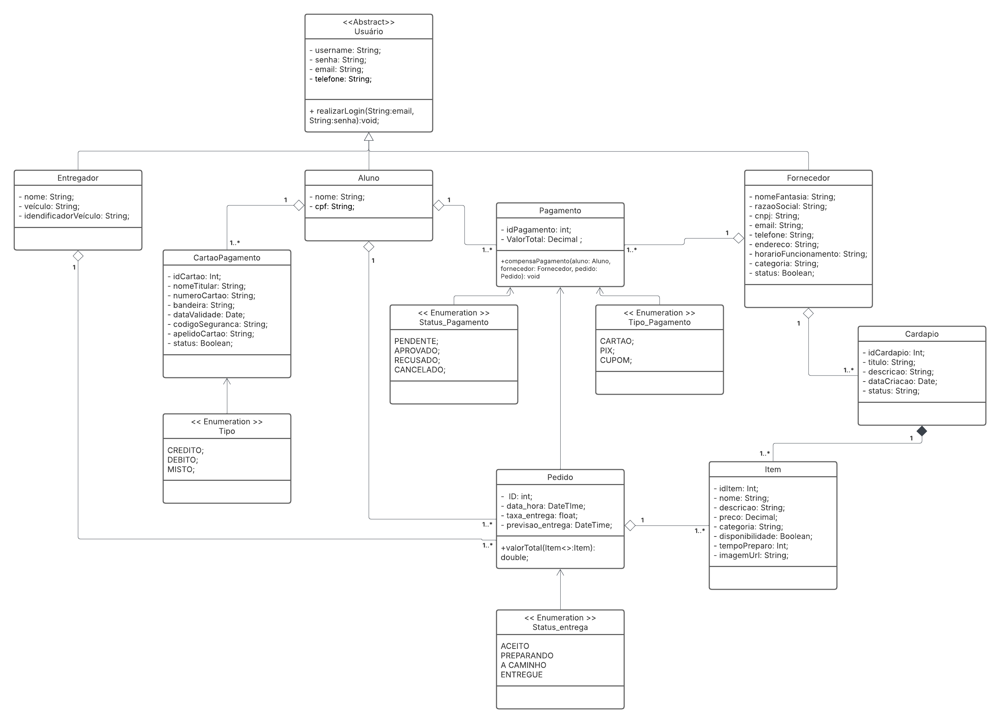
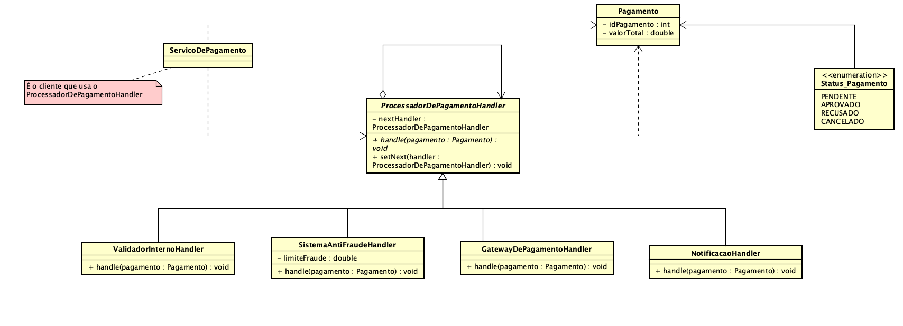

# Chain of Responsibility

## Introdução

Esse documento apresenta explicações referentes ao padrão de projeto Chain of Responsibility e detalha como ele foi utilizado dentro do projeto Pode Pedir FCTE. 

O padrão Chain of Responsibility evita acoplar o remetente de uma solicitação ao seu destinatário dando a mais de um objeto a chance de processar a solicitação. Com isso, são encadeados os objetos receptores e a solicitação é passada ao longo da cadeia até que um objeto a processe.


## Chain of Responsibility

O padrão Chain of Responsibility é apresentado no livro Design Patterns: Elements of Reusable Object-Oriented Software como um tipo de GOF comportamental

Um exemplo motivacional apresentado no livro de Gamma et. al. é com relação ...

Além disso, no livro os autores discutem algumas aplicabilidades desse padrão de projeto. Para isso, o padrão Chain of Responsibility deve ser aplicado quando todos os itens abaixo forem verdade.

- Nota 1
- Nota 2

O padrão Chain of Responsibility é composto por:

* **Componente 1:**

A seguir, são discutidas as vantagens e desvantagens desse padrão de projeto apontadas pelo Refactoring Guru.

### Vantagens

- 


## Aplicação no projeto

Para o GOF criacional Flyweight foi escolhido trabalhar com a classe de Pagamento do diagrama original.





Com isso, é possível também começar a representação do diagrama em forma de código. Para a construção do código foi escolhido utilizar Java com a IDE Eclipse, já para para a construção do diagrama foi escolhida a ferramenta Astah.


### Classe Serviço de Pagamento

**Nota:** Essa classe é o cliente que usa o handler, e ela que contém a corrente com a ordem dos handlers que serão utilizados.

```
package Chain;

public class ServicoDePagamento {
	
	private ProcessadorDePagamentoHandler chain;
	
	public ServicoDePagamento() {
		
		ProcessadorDePagamentoHandler validador = new ValidadorInternoHandler();
		ProcessadorDePagamentoHandler antifraude = new SistemaAntiFraudeHandler();
		ProcessadorDePagamentoHandler gateway = new GatewayDePagamentoHandler();
		ProcessadorDePagamentoHandler notificador = new NotificacaoHandler();
		
		validador.setNext(antifraude);
		antifraude.setNext(gateway);
		gateway.setNext(notificador);
		
		this.chain = validador;
		
	}
	
	public Pagamento processarPagamento (Pagamento pagamento) {
		
		System.out.println("Iniciando novo processamento para o pagamento de id: " + pagamento.getIdPagamento());
		
		this.chain.handle(pagamento);
		
		System.out.println("Processamento finalizado.");
		System.out.println("Resultado final: " + pagamento.getStatusPagamento());
		
		return pagamento;
		
	}

}
```

### Classe ProcessadorDePagamentoHandler

**Nota:** Essa é a classe mãe responsável por implementar o método handle que será utilizado pelas classes filhas quando elas acabarem a sua função e quiserem chamar o próximo método de verificação.

```
package Chain;

public abstract class ProcessadorDePagamentoHandler {
	
	protected ProcessadorDePagamentoHandler nextHandler;
	
	public void setNext(ProcessadorDePagamentoHandler nextHandler) {
		this.nextHandler = nextHandler;
	}
	
	public void handle(Pagamento pagamento) {
		if (this.nextHandler != null) {
			this.nextHandler.handle(pagamento);
		}
	}
}
```

### Classe ValidadorInterno (Primeiro handler da corrente)

```
package Chain;

public class ValidadorInternoHandler extends ProcessadorDePagamentoHandler {

	@Override
	public void handle(Pagamento pagamento) {
		System.out.println("Passando pelo handler: Validador Interno...");
		
		if (pagamento.getValorTotal() <= 0.0) {
			System.out.println("Erro encontrado no valor do pagamento, encerrando operação");
			pagamento.setStatusPagamento(StatusPagamento.REJEITADO);
		} else {
			System.out.println("Nenhum problema encontrado no validador interno, passando para o próximo hanlder...");
			super.handle(pagamento);
		}
	}
}
```

### Classe SistemaAntiFraude (Segundo handler da corrente)

```
package Chain;

public class SistemaAntiFraudeHandler extends ProcessadorDePagamentoHandler{
	
	private double limiteFraude = 5000.0;
	
	@Override
	public void handle(Pagamento pagamento) {
		System.out.println("Passando pelo handler: Sistema Anti-fraude...");
		
		if (pagamento.getValorTotal() > this.limiteFraude) {
			System.out.println("Alerta ! Pagamento acima do limite de fraude. Encerrando operação.");
			pagamento.setStatusPagamento(StatusPagamento.REJEITADO);
		} else {
			System.out.println("Nenhuma fraude encontrada, passando para o próximo hanlder...");
			super.handle(pagamento);
		}
	}

}
```

### Classe GatewayDePagamento (Terceiro handler da corrente)

```
package Chain;

public class GatewayDePagamentoHandler extends ProcessadorDePagamentoHandler{
	
	@Override
	public void handle(Pagamento pagamento) {
		System.out.println("Passando pelo handler: Gateway de Pagamento...");
		
		// Supondo que qualquer cobrança acima de 1000 reais seja rejeitada
		boolean sucesso = (pagamento.getValorTotal() <= 1000);
		
		if (sucesso) {
			System.out.println("Sucesso, Gateway autorizou o pagamento. Passando para o próximo handler");
			pagamento.setStatusPagamento(StatusPagamento.APROVADO);
		} else {
			System.out.println("Falha, Gateway não autorizou o pagamento. Encerrando operação.");
			pagamento.setStatusPagamento(StatusPagamento.REJEITADO);
		}
		super.handle(pagamento);
	}
}
```

### Classe Notificação (Quarto e último handler da corrente)

```
package Chain;

public class NotificacaoHandler extends ProcessadorDePagamentoHandler {
	
	@Override
	public void handle(Pagamento pagamento) {
		System.out.println("Passando pelo handler: Notificacao...");
		
		if (pagamento.getStatusPagamento() == StatusPagamento.APROVADO) {
			System.out.println("Pagamento aprovado. Enviando notificação para o aluno e para o fornecedor.");
		} else {
			System.out.println("Pagamento rejeitado. Encerrando operação.");
		}
	}
}
```

### Enum StatusPagamento 

```
package Chain;

public enum StatusPagamento {
    PENDENTE,
    APROVADO,
    REJEITADO,
    CANCELADO
}
```

### Classe Pagamento

```
package Chain;

public class Pagamento {

		private int idPagamento;
		private double valorTotal;
		private StatusPagamento status;
		
		public Pagamento(int idPagamento, double valorTotal) {
			this.idPagamento = idPagamento;
			this.valorTotal = valorTotal;
			this.status = StatusPagamento.PENDENTE;
			
		}
		
		public int getIdPagamento() {
			return idPagamento;
		}
		
		public double getValorTotal() {
			return valorTotal;
		}
		
		public StatusPagamento getStatusPagamento() {
			return status;
		}
		
		public void setStatusPagamento (StatusPagamento status) {
			this.status = status;
		}
}
```

### Classe de Testes

Com base em todos os blocos de código desenvolvidos até agora é possível criar uma classe responsável por juntar todas essas classes para que o código seja testado.

```
package Chain;

public class Testes {

	public static void main(String[] args) {
		
		ServicoDePagamento servico = new ServicoDePagamento();
		
		//  Teste 1: Pagamento Aprovado
        System.out.println("--- TESTE 1: APROVADO (R$ 250.00) ---");
        Pagamento pag1 = new Pagamento(101, 250.00);
        servico.processarPagamento(pag1);
        
        // Teste 2: Rejeitado no Handler Validador
        System.out.println("\n--- TESTE 2: REJEITADO NO VALIDADOR (R$ -50.00) ---");
        Pagamento pag2 = new Pagamento(102, -50.00);
        servico.processarPagamento(pag2);
        
        // Teste 3: Rejeitado no Handler Anti-Fraude
        System.out.println("\n--- TESTE 3: REJEITADO NO ANTI-FRAUDE (R$ 7000.00) ---");
        Pagamento pag3 = new Pagamento(103, 7000.00);
        servico.processarPagamento(pag3);
        
        // --- Teste 4: Rejeitado no Handler Gateway
        System.out.println("\n--- TESTE 4: REJEITADO NO GATEWAY (R$ 1500.00) ---");
        Pagamento pag4 = new Pagamento(104, 1500.00);
        servico.processarPagamento(pag4);

	}
}
```

## Quadro de Participações

| **Membro da equipe** | **Função** |
| :------------- | :--------- |
| [Luiz](https://github.com/luizfaria1989) | Documentação da página, criação do diagrama e dos blocos de código. |

## Referências

> GAMMA, Erich et al. Design patterns: elements of reusable object-oriented software. Reading, Mass.: Addison-Wesley, 1995.

> REFACTORING GURU. Flyweight. Disponível em: https://refactoring.guru/design-patterns/flyweight

## Histórico de Versões

| **Data**       | **Versão** | **Descrição**                         | **Autor**                                      | **Revisor**                                      | **Data da Revisão** |
| :--------: | :----: | :-------------------------------- | :----------------------------------------: | :----------------------------------------: | :-------------: |
| 23/10/2025 |  `0.1`   | Criação da página, dos blocos de código e diagrama. | [`@Luiz`](https://github.com/luizfaria1989) | [`@`](https://github.com/) |   00/00/0000    |