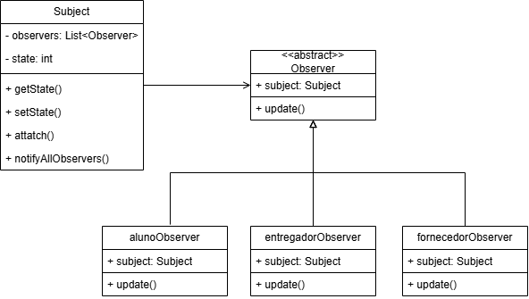

# Observer

## Introdução

Este documento explica o padrão de projeto comportamental Observer e apresenta a sua aplicação no **PodePedirFCTE**, desenvolvida com base no diagrama de xx elaborado, a partir do qual foram construídas a modelagem e a implementação do padrão.

## Explicação

[explicação do padrão]: #

Conforme Gamma et al.(1994), o padrão comportamental Observer estabelece uma relação de dependência do tipo um-para-muitos entre objetos, de modo que, quando um deles altera seu estado, todos os objetos dependentes são automaticamente notificados e atualizados.

[pode criar novas seções aqui se necessário com ###, por exemplo: Vantagens, Desvantagens]: #

### Estrutura e interações

O padrão é constituído por quatro componentes fundamentais, cuja interação se dá por meio de comunicações específicas entre o sujeito e seus observadores, sendo estruturado em duas interfaces e duas classes (GAMMA et al., 1994).

| **Elemento**       | **Descrição**                                                                                                                                             |
| :----------------- | :-------------------------------------------------------------------------------------------------------------------------------------------------------- |
| _Subject_          | Interface responsável por gerenciar os observadores, pois oferece métodos para registrá-los e removê-los conforme necessário.                             |
| _Observer_         | Interface que define o contrato de atualização a ser seguido pelos objetos que devem ser notificados sobre alterações no sujeito.                         |
| _ConcreteSubject_  | Classe que implementa o Subject e armazena o estado de interesse, além de enviar notificações aos observadores sempre que ocorre uma mudança relevante.   |
| _ConcreteObserver_ | Classe que forja o Observer, mantém uma referência ao ConcreteSubject e atualiza o próprio estado para permanecer consistente com o do sujeito observado. |

O fluxo de comunicação entre esses elementos ocorre da seguinte forma:

**1.** O ConcreteSubject notifica todos os seus observadores sempre que uma alteração em seu estado possa afetar a consistência desses observadores;

**2.** Após receber a notificação, o ConcreteObserver consulta o ConcreteSubject para obter as informações necessárias e ajusta o seu estado a fim de mantê-lo coerente com o do sujeito.

### Aplicabilidade

Segundo Gamma et al. (1994), o padrão Observer é indicado em situações em que uma abstração apresenta dois aspectos interdependentes que precisam ser tratados separadamente. Outrossim, ele também se aplica quando uma alteração em um objeto exige a atualização de outros, sem que se saiba previamente quantos são, ou quando um objeto deve notificar outros sem depender de detalhes sobre quem são ou como estão implementados.

### Vantagens e desvantagens

Em conformidade com Refactoring.Guru (2019?), o padrão apresenta duas vantagens e uma desvantagem em relação à sua aplicação prática. Dessa forma, as vantagens identificadas são:

- facilidade de extensão do comportamento do sistema, uma vez que novas classes de observadores podem ser adicionadas sem a necessidade de alterar o código do sujeito, e vice-versa, quando há uma interface comum para o sujeito;
- flexibilidade na definição das relações entre objetos em tempo de execução, o que possibilita o estabelecimento dinâmico de dependências entre sujeitos e observadores conforme as necessidades do sistema.

Em contrapartida, a desvantagem observada é que os observadores são notificados em ordem não determinística, o que pode gerar comportamentos inesperados quando a sequência de atualização é relevante para a consistência do sistema.

## Aplicação no projeto

A implementação do padrão Observer no **PodePedirFCTE**

[foi desenvolvida para facilitar a criação de diferentes tipos de usuários no sistema de delivery: **Aluno**, **Entregador** e **Fornecedor**. O padrão foi aplicado utilizando **TypeScript** como linguagem de programação, aproveitando recursos de tipagem estática e orientação a objetos para garantir robustez e manutenibilidade do código.]: #

### Estrutura da implementação

A implementação do padrão Observer no **PodePedirFCTE** foi desenvolvida para gerenciar as notificações de status de entrega entre diferentes tipos de usuários do sistema: **Aluno**, **Entregador** e **Fornecedor**. O padrão foi aplicado utilizando **TypeScript** como linguagem de programação, aproveitando recursos de tipagem estática e orientação a objetos para garantir robustez e manutenibilidade do código.

A aplicação do padrão segue a estrutura clássica definida na literatura, adaptada para o contexto específico do sistema:

#### **1. Classe Abstrata Observer**

```typescript
export abstract class Observer {
  protected subject: Subject;

  constructor(subject: Subject) {
    this.subject = subject;
  }

  public abstract update(): void;
}
```

Esta classe abstrata define o contrato base para todos os observers concretos, estabelecendo a referência ao subject e o método `update()` que deve ser implementado por cada observer específico.

#### **2. Classe Subject (ConcreteSubject)**

```typescript
export class Subject {
  private observers: Observer[] = [];
  private state: number = 0;

  public attach(observer: Observer): void {
    /* Anexa observer */
  }
  public detach(observer: Observer): void {
    /* Remove observer */
  }
  public notifyAllObservers(): void {
    /* Notifica todos */
  }
  public getState(): number {
    /* Retorna estado atual */
  }
  public setState(state: number): void {
    /* Altera estado e notifica */
  }
}
```

A classe `Subject` representa o sistema de pedidos que mantém o estado das entregas e gerencia a lista de observers, notificando-os sempre que há mudanças no status.

#### **3. Concrete Observers**

Foram implementados três observers concretos, cada um especializado em receber e processar notificações específicas para seu tipo de usuário:

- **`AlunoObserver`**: Responsável por notificar alunos sobre o progresso de seus pedidos, focando na experiência do cliente
- **`EntregadorObserver`**: Encarregado de informar entregadores sobre novos pedidos e instruções de entrega
- **`FornecedorObserver`**: Dedicado a atualizar fornecedores sobre o processo de preparação e retirada de pedidos

Cada observer concreto implementa o método `update()` com mensagens personalizadas conforme sua função no sistema:

```typescript
export class AlunoObserver extends Observer {
  public update(): void {
    const status = this.subject.getState();
    // Mensagens específicas para alunos
    switch (status) {
      case 1:
        mensagem = "🍽️ Seu pedido foi confirmado...";
        break;
      case 2:
        mensagem = "👨‍🍳 Seu pedido está sendo preparado...";
        break;
      // ...
    }
  }
}
```

#### **4. Fluxo de Notificação**

O sistema implementa um fluxo completo de notificações que acompanha todo o ciclo de vida de um pedido:

1. **Status 1 - Pedido Confirmado**: Restaurante confirma o pedido
2. **Status 2 - Em Preparação**: Pedido sendo preparado na cozinha
3. **Status 3 - Pedido Pronto**: Aguardando retirada pelo entregador
4. **Status 4 - Saiu para Entrega**: Entregador coletou e está a caminho
5. **Status 5 - Entrega Concluída**: Pedido entregue ao cliente

### Ferramentas e Tecnologias Utilizadas

- **TypeScript 5.0+**: Linguagem principal, proporcionando tipagem estática e recursos avançados de OOP
- **Node.js**: Runtime para execução do código
- **ts-node**: Para execução direta de arquivos TypeScript durante desenvolvimento
- **npm**: Gerenciamento de dependências e scripts de build
- **VS Code**: Ambiente de desenvolvimento integrado

### Benefícios Alcançados

A implementação do padrão Observer trouxe vantagens significativas para o projeto:

1. **Notificação Automática**: Todos os interessados são notificados automaticamente sobre mudanças de estado
2. **Desacoplamento**: Subject e observers são independentes, facilitando manutenção
3. **Personalização**: Cada observer pode processar as notificações de forma específica
4. **Extensibilidade**: Novos tipos de observers podem ser facilmente adicionados
5. **Consistência**: Garante que todos os participantes tenham informações atualizadas

### Demonstração Prática

O arquivo `demo.ts` demonstra o uso completo do padrão:

```typescript
// Criando o subject (sistema de pedidos)
const sistemaPedidos = new Subject();

// Criando observers
const aluno = new AlunoObserver(sistemaPedidos);
const entregador = new EntregadorObserver(sistemaPedidos);
const fornecedor = new FornecedorObserver(sistemaPedidos);

// Simulando mudanças de estado
sistemaPedidos.setState(1); // Pedido confirmado
sistemaPedidos.setState(2); // Em preparação
sistemaPedidos.setState(3); // Pronto
// ... todos os observers são notificados automaticamente
```

Esta implementação demonstra como o padrão Observer facilita a comunicação entre diferentes participantes no sistema **PodePedirFCTE**, garantindo que todos recebam informações relevantes e atualizadas sobre o status das entregas.

### Modelagem

<p style="text-align: center">
    <strong>Figura 1</strong> – Diagrama UML Observer cadastro de usuários no PodePedirFCTE
</p>



<p>
    <strong>Autor: autoria da equipe</strong>, 2025
</p>

### Implementação

A implementação do padrão Observer no **PodePedirFCTE** está organizada em uma estrutura de diretórios que reflete claramente os componentes do padrão:

```
observer/
├── src/
│   ├── observers/         # Observer classes
│   │   ├── observer.ts           # Classe abstrata Observer
│   │   ├── alunoObserver.ts      # Observer concreto para alunos
│   │   ├── entregadorObserver.ts # Observer concreto para entregadores
│   │   └── fornecedorObserver.ts # Observer concreto para fornecedores
│   ├── subject.ts         # Classe Subject (ConcreteSubject)
│   └── demo.ts           # Demonstração de uso
```

#### Principais Características Técnicas

**1. Classe Abstrata Observer**: A classe abstrata `Observer` estabelece o contrato base para todos os observers, garantindo que o método `update()` seja implementado e mantendo a referência protegida ao subject.

**2. Especialização por Herança**: Cada observer concreto herda da classe abstrata e implementa comportamentos específicos:

- `AlunoObserver`: Mensagens focadas na experiência do cliente
- `EntregadorObserver`: Instruções operacionais para entregadores
- `FornecedorObserver`: Informações de gestão do processo produtivo

**3. Gestão de Estado Centralizada**: A classe `Subject` mantém uma lista de observers e gerencia as notificações de forma automática sempre que o estado muda.

**4. Mensagens Personalizadas**: Cada observer processa as notificações de acordo com seu contexto, fornecendo informações relevantes e específicas para cada tipo de usuário.

**5. Anexação Automática**: Os observers se anexam automaticamente ao subject durante sua criação, simplificando o uso da implementação.

#### Exemplo de Uso Completo

```typescript
// Criando o sistema de pedidos (Subject)
const sistemaPedidos = new Subject();

// Criando observers que se anexam automaticamente
const aluno = new AlunoObserver(sistemaPedidos);
const entregador = new EntregadorObserver(sistemaPedidos);
const fornecedor = new FornecedorObserver(sistemaPedidos);

// Mudança de estado notifica todos automaticamente
sistemaPedidos.setState(1); // Todos recebem notificação personalizada
```

### Resultados e Insights

A implementação do padrão Observer no projeto revelou aspectos importantes sobre sua aplicabilidade em sistemas reais:

**1. Execução Bem-Sucedida**: O teste de execução confirma que o padrão foi implementado corretamente, com notificações personalizadas para cada tipo de usuário:

```
--- STATUS 1: PEDIDO CONFIRMADO ---
🎓 [ALUNO] 🍽️ Seu pedido foi confirmado pelo restaurante e está sendo preparado!
🛵 [ENTREGADOR] 📋 Novo pedido disponível para retirada no restaurante!
🏪 [FORNECEDOR] 🔔 Novo pedido recebido! Confirme e inicie o preparo!
```

**2. Comunicação Eficiente**: Observa-se que todos os participantes do sistema recebem informações relevantes simultaneamente, mantendo todos sincronizados com o estado atual do pedido.

**3. Personalização Efetiva**: Cada tipo de observer recebe mensagens específicas para seu contexto, demonstrando a flexibilidade do padrão na customização de comportamentos.

### Instruções para Execução do Código

Para executar e testar a implementação do padrão Observer no **PodePedirFCTE**, siga os passos abaixo:

#### Pré-requisitos

- **Node.js** (versão 16 ou superior)
- **npm** (gerenciador de pacotes do Node.js)
- **Git** (para clonar o repositório)

#### Passos para Execução

**1. Clone o repositório e navegue para o diretório do projeto:**

```bash
git clone https://github.com/UnBArqDsw2025-2-Turma01/2025.2-T01-G7_PodePedirFCTE_Entrega_03.git
cd 2025.2-T01-G7_PodePedirFCTE_Entrega_03/observer
```

**2. Instale as dependências do projeto:**

```bash
npm install
```

**3. Execute o projeto em modo de desenvolvimento:**

```bash
npm run dev
```

**4. Para compilar o TypeScript para JavaScript:**

```bash
npm run build
```

**5. Para executar o código compilado:**

```bash
npm start
```

#### Scripts Disponíveis

O projeto inclui os seguintes scripts no `package.json`:

- `npm run dev`: Executa o código TypeScript diretamente usando ts-node
- `npm run build`: Compila o TypeScript para JavaScript
- `npm start`: Executa o código JavaScript compilado
- `npm run watch`: Compila automaticamente quando há mudanças no código

#### Saída Esperada

Ao executar `npm run dev`, você deve ver uma saída similar demonstrando o fluxo completo de notificações:

```
🚀 === DEMONSTRAÇÃO DO SISTEMA DE STATUS DE ENTREGA ===

--- STATUS 1: PEDIDO CONFIRMADO ---
🎓 [ALUNO] 🍽️ Seu pedido foi confirmado pelo restaurante e está sendo preparado!
🛵 [ENTREGADOR] 📋 Novo pedido disponível para retirada no restaurante!
🏪 [FORNECEDOR] 🔔 Novo pedido recebido! Confirme e inicie o preparo!

--- STATUS 2: PREPARANDO PEDIDO ---
🎓 [ALUNO] 👨‍🍳 Seu pedido está sendo preparado na cozinha!
🛵 [ENTREGADOR] ⏳ Pedido ainda sendo preparado. Aguarde para retirada.
🏪 [FORNECEDOR] 👨‍🍳 Pedido em preparo na cozinha. Mantenha a qualidade!
```

Esta saída confirma que o padrão Observer foi implementado corretamente, demonstrando como diferentes tipos de observers recebem notificações personalizadas conforme suas necessidades específicas.

### Dificuldades encontradas e soluções

Durante o desenvolvimento, foram encontrados os seguintes desafios que foram solucionados:

[**1. Tipagem Dinâmica vs. Tipagem Estática**: O maior desafio foi conciliar a flexibilidade necessária para acessar métodos específicos de cada builder com a rigidez da tipagem TypeScript. A solução encontrada foi utilizar verificação de tipos em tempo de execução (`"setNome" in this.builder`) combinada com type casting (`this.builder as any`).]: #
[**2. Gestão de Estado dos Builders**: descrição]: #

## Quadro de participações

| **Membro da equipe**                         | **Função**                                  |
| :------------------------------------------- | :------------------------------------------ |
| [Rodrigo](https://github.com/rodrigoFAmaral) | Criação do UML e codificação                |
| [Willian](https://github.com/Wooo589)        | Documentação inicial e explicação do padrão |

## Referências

> OBSERVER. _In_: REFACTORING.GURU. [_s.l.: s.n._, 2019?]. Disponível em: https://refactoring.guru/design-patterns/observer. Acesso em: 21 out. 2025.

> GAMMA, Erich _et al._ **Design Patterns**: elements of reusable object-oriented software. Boston, MA: Addison-Wesley, 1994.

## Histórico de Versões

|  **Data**  | **Versão** | **Descrição**                                                                                                                    |                    **Autor**                    |                   **Revisor**                   | **Data da Revisão** |
| :--------: | :--------: | :------------------------------------------------------------------------------------------------------------------------------- | :---------------------------------------------: | :---------------------------------------------: | :-----------------: |
| 21/10/2025 |   `0.1`    | Adicionar estrutura inicial da página, introdução e explicação                                                                   |    [`@Willian`](https://github.com/Wooo589)     | [`@Rodrigo`](https://github.com/rodrigoFAmaral) |     22/10/2025      |
| 22/10/2025 |   `0.2`    | Adicionar estrutura para documentação da aplicação no projeto                                                                    |    [`@Willian`](https://github.com/Wooo589)     | [`@Rodrigo`](https://github.com/rodrigoFAmaral) |     22/10/2025      |
| 23/10/2025 |   `0.3`    | Implementação do padrão Observer               | [`@Rodrigo`](https://github.com/rodrigoFAmaral)  [`@Willian`](https://github.com/Wooo589) |    [`@Willian`](https://github.com/Wooo589)  [`@Rodrigo`](https://github.com/rodrigoFAmaral)   |     23/10/2025      |
| 23/10/2025 |   `0.4`    | Adição da seção Estrutura da Implementação      | [`@Rodrigo`](https://github.com/rodrigoFAmaral)  |    [`@Willian`](https://github.com/Wooo589)   |     23/10/2025      |
