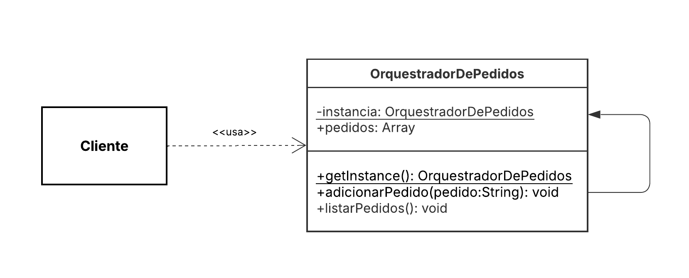

# 3.1.1. Singleton

## Introdução

Este documento tem como objetivo apresentar a aplicação do padrão de projeto Singleton, um dos padrões GoF (Gang of Four) (GAMMA et al., 1994), no contexto do sistema representado pelo diagrama de componentes fornecido. O padrão Singleton, conforme descrito pelo Refactoring Guru (2025), "permite a você garantir que uma classe tem apenas uma instância, enquanto provê um ponto de acesso global para esta instância". Segundo Serrano (2025), ele é frequentemente aplicado em casos onde componentes únicos da aplicação precisam ser compartilhados por diferentes partes do sistema.

## Metodologia

Com base no escopo do sistema e no diagrama de componentes fornecido, foram analisadas diversas áreas em que a aplicação do padrão Singleton seria pertinente. A avaliação considerou critérios como centralização de controle, necessidade de uma única fonte de verdade e reutilização de instâncias compartilhadas.

Durante o processo de análise, foram considerados os seguintes candidatos ao uso de Singleton:

1.  **Orquestrador de Pedidos**
2.  **Gerenciador de Notificações**
3.  **Gerenciador de Pagamentos** (Para centralizar a comunicação com um gateway de pagamento único)
4.  **Gerenciador de Configurações** (Componente implícito para carregar variáveis de ambiente)
5.  **Um serviço de Logging centralizado**

Dentre esses, o **Orquestrador de Pedidos** foi selecionado como exemplo prático neste documento. A razão da escolha é que este componente representa o "cérebro" do ciclo de vida de um pedido, necessitando de um ponto único e centralizado de controle para coordenar múltiplos serviços (pagamentos, restaurantes, entregas) e garantir a consistência do estado dos pedidos, evitando condições de corrida ou processamento duplicado.

## Desenvolvimento

No projeto **Pode Pedir FCTE**, o padrão Singleton foi aplicado para garantir que exista apenas uma instância do `Orquestrador de Pedidos` em execução no backend. Isso centraliza a lógica de negócios complexa que coordena o status de um pedido entre múltiplos serviços, assegurando que toda modificação no fluxo de um pedido passe por este único ponto de controle.

A implementação foi feita utilizando o framework **NodeJs**. 

### Estrutura do Singleton no Projeto

A implementação no projeto segue a estrutura clássica do padrão Singleton, conforme definido pelo GoF (GAMMA et al., 1994). Esta abordagem garante o controle explícito sobre a instanciação do componente, forçando o sistema a utilizar um único ponto de acesso.

A estrutura é dividida da seguinte forma:

* **A Classe Singleton:** A classe `OrquestradorDePedidos` é definida com duas características centrais:
    1.  Um **construtor privado**, que impede que qualquer outra classe ou componente externo crie instâncias dela diretamente usando o operador `new`.
    2.  Um **atributo estático e privado** que armazena a instância única da própria classe.

* **O Ponto de Acesso Global:** A classe `OrquestradorDePedidos` expõe um **método público estático**, comumente chamado de `getInstance()`. Este método é o único meio pelo qual o resto do sistema pode obter o objeto orquestrador (REFACTORING GURU, 2025). Internamente, este método verifica se a instância estática já foi criada. Se não foi (na primeira chamada), ele invoca o construtor privado para criar o objeto e o armazena no atributo estático. Em todas as chamadas subsequentes, ele simplesmente retorna a instância que já existe.

* **Os Consumidores do Singleton:** Qualquer outro componente do sistema (como um gerenciador de pagamentos ou um serviço de notificações) que precise interagir com o orquestrador, deve obrigatoriamente invocar o método estático `OrquestradorDePedidos.getInstance()` para obter a referência do objeto. Conforme aponta Serrano (2025), isso garante que, independentemente de quantos consumidores existam ou de onde eles estejam no código, todos estarão operando sobre a *mesma e única instância* do orquestrador, centralizando de fato o controle do fluxo dos pedidos..

##### Código Aplicado

##### Arquivo: `src/core/OrquestradorDePedidos.js`
```ts

// Classe responsável por gerenciar pedidos utilizando o padrão Singleton
class OrquestradorDePedidos {
    // Propriedade estática que vai armazenar a instância única da classe
    static instancia;

    // Construtor da classe
    constructor() {
        console.log("Orquestrador de Pedidos criado!");
        // Array que armazenará todos os pedidos
        this.pedidos = [];
    }

    // Método estático para obter a instância única da classe
    static getInstance() {
        // Se ainda não existe instância, cria uma nova
        if (!OrquestradorDePedidos.instancia) {
            OrquestradorDePedidos.instancia = new OrquestradorDePedidos();
        } else {
            // Caso já exista, apenas informa que a instância existente será usada
            console.log("A instância já existe! Retornando a instância existente.");
        }
        // Retorna sempre a mesma instância
        return OrquestradorDePedidos.instancia;
    }

    // Método para adicionar um pedido ao array de pedidos
    adicionarPedido(pedido) {
        this.pedidos.push(pedido);
        console.log(`Pedido adicionado: ${pedido}`);
    }

    // Método para listar todos os pedidos atuais
    listarPedidos() {
        console.log("Pedidos atuais:", this.pedidos);
    }
}

// Exporta a classe para que possa ser utilizada em outros arquivos
module.exports = { OrquestradorDePedidos };

```
##### Arquivo: `src/index.js`
```ts
const { OrquestradorDePedidos } = require("./core/Configuracao");

// Tentando criar múltiplas instâncias
const orquestrador1 = OrquestradorDePedidos.getInstance();
const orquestrador2 = OrquestradorDePedidos.getInstance();

// Adicionando pedidos
orquestrador1.adicionarPedido("Pedido 001");
orquestrador2.adicionarPedido("Pedido 002");

// Listando pedidos de ambas as instâncias
orquestrador1.listarPedidos();
orquestrador2.listarPedidos();

// Verificação se é a mesma instância
console.log("Mesma instância?", orquestrador1 === orquestrador2);

```

##### Saída do Terminal
```bash
Orquestrador de Pedidos criado!
A instância já existe! Retornando a instância existente.
Pedido adicionado: Pedido 001
Pedido adicionado: Pedido 002
Pedidos atuais: [ 'Pedido 001', 'Pedido 002' ]
Pedidos atuais: [ 'Pedido 001', 'Pedido 002' ]
Mesma instância? true
```


<font size="2"><p style="text-align: center"><b>Figura 1:</b> Diagrama de classes representando o padrão Singleton (GoF)</p></font>


<div style="text-align: center;">





</div>


<font size="2"><p style="text-align: center"><b>Autor:</b> <a href="https://github.com/...">Nome</a>, 2025</p></font> 
 ## Demonstração do Código sendo Executado


- [Execução do Código](...)</br>

Participantes: ...</br>

- [Repositório do Codigo](...)


## Conclusão

A aplicação do padrão Singleton no Orquestrador de Pedidos demonstrou-se uma decisão de design acertada para o contexto do projeto Pode Pedir FCTE. Ao centralizar a lógica de coordenação do ciclo de vida dos pedidos em uma única instância, garantimos a consistência dos dados e evitamos conflitos de estado que poderiam surgir com múltiplas instâncias concorrentes.

A adoção da implementação do singleton através de um construtor privado e um método estático getInstance(), tornou a regra de negócio da "instância única" explícita e controlada diretamente pela própria classe OrquestradorDePedidos. Esta abordagem clássica (GAMMA et al., 1994) garante que o ponto de acesso global seja inequívoco e nos dá controle total sobre o ciclo de vida do objeto.

Embora esta implementação seja a forma canônica do padrão, estamos cientes de suas desvantagens notórias, como o acoplamento mais forte dos consumidores à classe concreta e os desafios que ela impõe aos testes unitários, como aponta o Refactoring Guru (2025). Contudo, para o propósito acadêmico de demonstrar o padrão e assegurar rigorosamente o controle centralizado do orquestrador, a escolha se justifica.

## Bibliografia

> Refactoring Guru. *Singleton*. Disponível em: [https://refactoring.guru/pt-br/design-patterns/singleton](https://refactoring.guru/pt-br/design-patterns/singleton). Acesso em: 27 maio 2025.

> SERRANO, Milene. AULA - GOFS CRIACIONAIS. Slides. Universidade de Brasília, 2025. Acesso em: 27 maio 2025.

> GAMMA, Erich; HELM, Richard; JOHNSON, Ralph; VLISSIDES, John. *Design Patterns: Elements of Reusable Object-Oriented Software*. Addison-Wesley, 1994.

> NESTJS. *Official Documentation*. Disponível em: [https://docs.nestjs.com](https://docs.nestjs.com)

> POSTGRESQL. *Node.js and PostgreSQL*. Disponível em: [https://node-postgres.com](https://node-postgres.com)

## Histórico de Versões

| Versão | Data       | Descrição                                                             | Autor(es)                                      | Revisor(es) | Detalhes da revisão |
| ------ | ---------- | --------------------------------------------------------------------- | ---------------------------------------------- | ----------- | ------------------- |
| 1.0    | 06/10/2025 | Inicialização do Documento com Introdução, Metodologia e Bibliografia | [Nathan Batista](https://github.com/Nathan-bs) |   [Cayo Alencar](https://github.com/Cayoalencar)          |A estrutura se demonstrou apropriada para a inclusão dos conteúdos , a bibliografia descrita foi a a utilizada no desenvolvimento da atividade  e a metodologia está de acordo com a adotada pelo grupo                    |
| 1.1    | 18/10/2025 | Preenchimento do Desenvolvimento e Conclusão focado no Orquestrador de Pedidos | [Cayo Alencar](https://github.com/Cayoalencar) |             |                     |