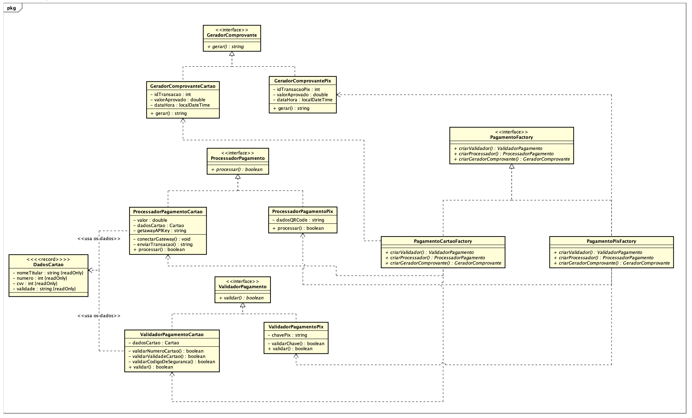

# Abstract Factory

## Introdução

Esse documento apresenta explicações referentes ao padrão de projeto Abstract Factory e detalha como ele foi utilizado dentro do projeto Pode Pedir FCTE. 

O padrão Abstract Factory provê uma interface para a criação de famílias de objetos relacionados ou dependentes sem especificar suas classes concretas.

## Abstract Factory

O padrão Factory Method surgiu a partir de um problema onde havia uma classe sendo utilizada em grande proporção em um sistema. Entretando, após a expansão do sistema, a adição de classes semelhantes a ela gera a necessidade de revisão e possível alteração em todo o código da aplicação.

O padrão Abstract Factory é apresentado no livro Design Patterns: Elements of Reusable Object-Oriented Software como um tipo de GOF criacional. Para isso, ele vem como uma forma de criar famílias de produtos relacionados sem instânciar as classes diretamente, de forma que ele pode ser aplicado para cenários em que:

- O sistema deve ser idependente de como seus produtos são criados, compostos e representados;
- O sistema deve ser configurado com uma de múltiplas famílias de produtos;
- A família de objetos de produto é designada para ser usada em conjunto, e o programador deve forçar que isso aconteça;
- É pretendido prover uma biblioteca de classe de produtos, e é intendido que seja acessado apenas suas interfaces e não suas implementações.

A fim de ter uma explicação mais lúdica e didática, segue a explicação que o site [Refactoring Guru](https://refactoring.guru/) apresenta para explicar a problemática que incentivou a criação do padrão:

O site Refactoring Guru explica esse padrão utilizando um exemplo em que o programador está desenvolvendo um simulador de vendas de móveis em que o código consiste de classes que representam:

1. Uma família de produtos relacionados, como sofá, cadeira, mesa de café;
2. Diversas variantes desses produtos, em que existem esses móveis podem ser comprados em variantes como: art deco, victoriana, moderna.

Considerando isso, o programador precisa de uma maneira para criar individualmente os objetos para que eles combinem com os objetos da mesma família.

A solução para resolver esse problema é utilizar o Abstract Factory como padrão de projeto. Pois, esse padrão diz que devem ser criadas interfaces para cada um dos diferentes produtos de uma família, assim, é preciso criar uma interface para o sofá, outra para a cadeira e assim em diante. Além disso, as variantes, art deco, victoriana e moderna, irão seguir como padrão essas interfaces.

O próximo passo é implementar a fábrica abstrata, uma interface que contém os métodos de criação de cada um dos produtos da família, dessa forma, teriam métodos para criar uma cadeira, uma mesa ou um sofá, esses métodos retornam os produtos abstratos, só a cadeira por exemplo. Tendo a fábrica abstrata, a partir dela é possível criar diferentes fábricas, cada uma responsáveis por implementar os métodos da fábrica abstrata, mas neste caso, são métodos voltados para a criação de uma variante específica de móveis. Com isso, é possível ter uma fábrica responsável por criar apenas móveis do tipo moderno, por exemplo.

### Vantagens

- **Isola Classes Concretas**: O Abstract Factory ajuda a controlar as classes de objetos produtos que a aplicação cria. A fábrica neste caso, fica responsável por encapsular a responsabilidade e o processo de criar objetos produtos, de forma que isola o cliente das implementações das classes;

- **Faz com que a troca de família de produtos seja fácil**: A classe concreta da fábrica aparece apenas uma vez na aplicação, fazendo com que seja fácil trocar a classe concreta da fábrica que está sendo utilizada na aplicação;

- **Promove consistência entre os produtos**: Quando um produto objetos em uma família e planejado para trabalhar juntos, é importante com que a aplicação use objetos de apenas uma família por vez. 

### Desvantagens

- **O suporte para novos tipos de produtos é difícil:** Extender fábricas abstratas para produzir novos tipos de produtos não é fácil. Isso acontece porque a interface do Abstract Factory fixa o conjunto de produtos que devem ser criados.

## Aplicação no projeto

Para o GOF criacional Abstract Factory foi escolhido trabalhar com a classe de Pagamento do diagrama original


Dessa forma foi possível criar um conjunto novo de 12 classes que buscam dividir o grau de funções, e com isso diminuir o grau de acoplamento da classe Pagamento. Para isso, foi escolhido que pagamento se tornaria uma fábrica abstrata, sendo agora representado através de uma interface que possui três diferentes métodos, um focado na validação do pagamento, outro focado em processar o pagamento e um terceiro para gerar os comprovantes. 

Com isso, é possível ter produtos diferenciados para cada um desses três métodos, neste caso, foi representado no diagrama e em código produtos que buscam aplicar esses métodos para as formas de pagamento Pix e cartão de crédito. Mas isso pode ser expadido para novos métodos de pagamento como cartão de débito, dinheiro e através de cupons de desconto.

Dessa forma, o novo diagrama contendo a refatoração da classe Pagamento pode ser visto na figura abaixo.



Além disso, é possível também começar a representação do diagrama em forma de código. Para a construção do código foi escolhido utilizar Java com a IDE Eclipse, já para para a construção do diagrama foi escolhida a ferramenta Astah.

### Interface GeradorComprovante

```
public interface GeradorComprovante {
	
	String gerar();

}
```

### Interface ProcessadorPagamento

```
public interface ProcessadorPagamento {
	
	ResultadoTransacao processar();

}
```

### Interface ValidadorPagamento

```
public interface ValidadorPagamento {
	
	boolean validar();

}
```

### Interface PagamentoFactory (Abstract Factory)

```
public interface PagamentoFactory {
	
	ValidadorPagamento criarValidador();
	ProcessadorPagamento criarProcessador();
	GeradorComprovante criarGeradorComprovante();

}
```

### Classe PagamentoCartaoFactory

```
public class PagamentoCartaoFactory implements PagamentoFactory {

    @Override
    public ValidadorPagamento criarValidador() {
        return new ValidadorPagamentoCartao();
    }

    @Override
    public ProcessadorPagamento criarProcessador() {
        return new ProcessadorPagamentoCartao();
    }

    @Override
    public GeradorComprovante criarGeradorComprovante() {
        return new GeradorComprovanteCartao();
    }
}
```

### Classe PagamentoPixFactory

```
public class PagamentoPixFactory implements PagamentoFactory {

    @Override
    public ValidadorPagamento criarValidador() {
        return new ValidadorPagamentoPix();
    }

    @Override
    public ProcessadorPagamento criarProcessador() {
        return new ProcessadorPagamentoPix();
    }

    @Override
    public GeradorComprovante criarGeradorComprovante() {
        return new GeradorComprovantePix();
    }
}
```

### Classe GeradorComprovanteCartao

```
public class GeradorComprovanteCartao implements GeradorComprovante {
	
	int idTransacao;
	double valorAprovado;
	LocalDateTime dataHora;
	
    @Override
    public String gerar() {
        System.out.println("Gerando comprovante para Cartão de Crédito...");
        return "--- Comprovante Cartão ---\nID Transação: 12345\nValor: R$ 10,00";
    }
}
```

### Classe GeradorComprovantePix

```
public class GeradorComprovantePix implements GeradorComprovante {
	
	int idTransacaoPix;
	
    @Override
    public String gerar() {
        System.out.println("Gerando comprovante para Pix...");
        return "--- Comprovante Pix ---\nID Transação: 12345\nValor: R$ 10,00";
    }
}

```

### Classe ProcessadorPagamentoCartao

```
public class ProcessadorPagamentoCartao implements ProcessadorPagamento {
	
	double valor;
	Cartao dadosCartao;
	String getawayAPIKey;
	
    @Override
    public ResultadoTransacao processar() {
        System.out.println("Processando pagamento via Cartão de Crédito com o Gateway...");
        ResultadoTransacao res = new ResultadoTransacao();
        res.foiAprovado = true;
        res.mensagem = "Pagamento com cartão aprovado!";
        return res;
    }
}
```

### Classe ProcessadorPagementoPix

```
public class ProcessadorPagamentoPix implements ProcessadorPagamento {
	
	String DadosQRCode;
	
    @Override
    public ResultadoTransacao processar() {
        System.out.println("Processando pagamento via Pix com o Gateway...");
        ResultadoTransacao res = new ResultadoTransacao();
        res.foiAprovado = true;
        res.mensagem = "Pagamento com PIX aprovado!";
        return res;
    }
}
```

### Classe ValidadorPagamentoCartao

```
public class ValidadorPagamentoCartao implements ValidadorPagamento {
	
	int numeroCartao;
	String nomeCartao;
	String validadeCartao;
	int codigoDeSeguranca;
	
    @Override
    public boolean validar() {
        System.out.println("Validando dados do Cartão de Crédito...");
        return true;
    }
}
```

### Classe ValidadorPagamentoPix

```
public class ValidadorPagamentoPix implements ValidadorPagamento {
	
	String chavePix;
	
    @Override
    public boolean validar() {
        System.out.println("Validando dados do Pix...");
        return true;
    }
}
```

## Quadro de Participações

| **Membro da equipe** | **Função** |
| :------------- | :--------- |
| [Luiz](https://github.com/luizfaria1989) | Documentação da Introdução e do Abstract Factory |

## Referências

> GAMMA, Erich et al. Design patterns: elements of reusable object-oriented software. Reading, Mass.: Addison-Wesley, 1995.

> REFACTORING GURU. Abstract Factory. Disponível em: https://refactoring.guru/design-patterns/abstract-factory.

## Histórico de Versões

| **Data**       | **Versão** | **Descrição**                         | **Autor**                                      | **Revisor**                                      | **Data da Revisão** |
| :--------: | :----: | :-------------------------------- | :----------------------------------------: | :----------------------------------------: | :-------------: |
| 14/10/2025 |  `0.1`   | Criação da página e documentação da introdução, abstract factory e vantagens/desvantagens | [`@Luiz`](https://github.com/luizfaria1989) | [`@`](https://github.com/) |   00/00/0000    |
| 15/10/2025 |  `0.2`   | Adição do diagrama e dos códigos. | [`@Luiz`](https://github.com/luizfaria1989) | [`@`](https://github.com/) |   00/00/0000    |
| 16/10/2025 |  `0.3`   | Incrementa documentação do padrão de projeto. | [`@Luiz`](https://github.com/luizfaria1989) | [`@`](https://github.com/) |   00/00/0000    |