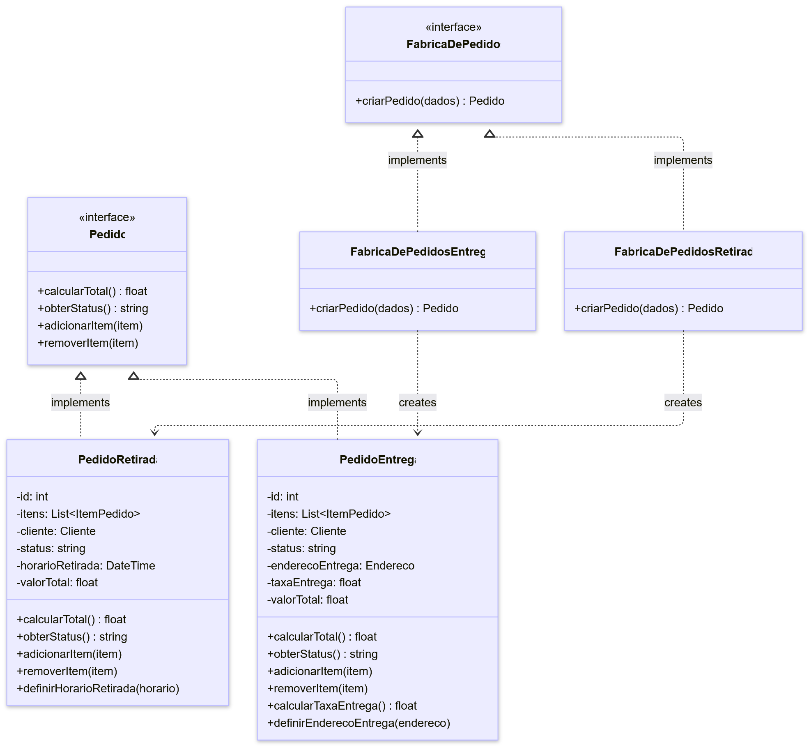

# Factory Method

## Introdução

Esse documento apresenta explicações referentes ao padrão de projeto Factory Method e detalha como ele foi utilizado dentro do projeto Pode Pedir FCTE. 

O padrão Factory Method propõe a criação de objetos em uma superclasse.

## Factory Method

O padrão Factory Method surgiu a partir de um problema onde havia uma classe sendo utilizada em grande proporção em um sistema. Entretando, após a expansão do sistema, a adição de classes semelhantes a ela gera a necessidade de revisão e possível alteração em todo o código da aplicação.

<!-- A fim de ter uma explicação mais lúdica e didática, segue a explicação que o site [Refactoring Guru](https://refactoring.guru/) apresenta para explicar a problemática que incentivou a criação do padrão:

[Adicinar explicacao] -->

### Vantagens

- **Desacoplamento:** Evita o acoplamento forte entre o criador e os produtos concretos;

- **Princípio da Responsabilidade Única:** Mover o código de criação do produto para um único lugar no programa, tornando o código mais fácil de manter e de alterar.

- **Princípio Aberto/Fechado:** Você pode introduzir novos tipos de produtos no programa sem quebrar o código cliente existente.

### Desvantagens

- **Complexidade do código:** A criação de várias subclasses novas para implementar o padrão pode aumentar a complexidade.

## Aplicação no projeto

<!-- - explicação de como utilizamos o padrão, insights, discussoes interessantes, aprofundamento em partes específicas do diagrama
- **comentar sobre ferramentas utilizadas, linguagens, fazer ligações com entregas anteriores!!**
- pode criar novas seções aqui se necessário com ###, por exemplo: Dificuldades Encontradas pela equipe -->

As integrantes responsáveis pelo padrão inicialmente estudaram sobre o padrão de projeto, Factory Method. Após isso, debateram por mensagens sobre como o padrão poderia ser implementado no projeto.

Para a aplicação no projeto, foi decidido que ele seria utilizado no contexto de diferentes tipos de pedidos, nesse caso Pedidos para Retirada e Pedidos para Entrega, sendo possível a criação de novos tipos de pedidos posteriormente que será facilitada e menos propensa a erros.

### Diagrama de Classes

O diagrama foi criado levando em consideração o [Diagrama de Classes](https://unbarqdsw2025-2-turma01.github.io/2025.2-T01-G7_PodePedirFCTE_Entrega_02/#/./Modelagem/ModelagemEstatica/DiagramaDeClasses) feito na segunda entrega e os debates entre as integrantes responsáveis pelo padrão de projeto.



Foram criadas duas interfaces:
- FabricaDePedidos: feita para padronizar um método comum entre todas as Fabricas de Pedidos. Dessa forma, arquivos que chamam o método serão capazes de chamá-lo sem precisar saber qual é o tipo do pedido.

- Pedido: feita para padronizar alguns métodos comuns entre todas os tipos de Pedidos. Dessa forma, arquivos que chamam os métodos serão capazes de chamá-lo sem precisar saber qual é o tipo do pedido.

Além disso, foram criadas duas fábricas:
- FabricaDePedidosEntrega:

- FabricaDePedidosRetirada:

As fábricas são responsáveis por instanciarem objetos dos tipos:
- PedidoRetirada:

- PedidoEntrega: 

### Implementação

A implementação do padrão do projeto foi baseada no Diagrama de Classes citado anteriormente.

#### Interfaces

##### [FabricaDePedidos]()
```
export class FabricaDePedidos {
  constructor() {
    if (this.constructor === FabricaDePedidos) {
      throw new Error("FabricaDePedidos é uma interface e não pode ser instanciada diretamente");
    }
  }

  criarPedido(dados) {
    throw new Error("Método criarPedido() deve ser implementado pelas fábricas concretas");
  }
}
```

##### [Pedido]()
```
export class Pedido {
  constructor() {
    if (this.constructor === Pedido) {
      throw new Error("Pedido é uma interface e não pode ser instanciada diretamente");
    }
  }

  calcularTotal() {
    throw new Error("Método calcularTotal() deve ser implementado");
  }

  obterStatus() {
    throw new Error("Método obterStatus() deve ser implementado");
  }

  adicionarItem(item) {
    throw new Error("Método adicionarItem() deve ser implementado");
  }

  removerItem(item) {
    throw new Error("Método removerItem() deve ser implementado");
  }
}

```

#### Fábricas

##### [FabricaDePedidosEntrega]()
```
import { FabricaDePedidos } from './FabricaDePedidos.js';
import { PedidoEntrega } from '../products/PedidoEntrega.js';

export class FabricaDePedidosEntrega extends FabricaDePedidos {
  criarPedido(dados) {
    console.log(`\n[FabricaDePedidosEntrega] Criando pedido de ENTREGA #${dados.id}...`);
    const pedido = new PedidoEntrega(dados.id, dados.cliente);
    console.log(`[FabricaDePedidosEntrega] Pedido de entrega criado com sucesso!`);
    return pedido;
  }
}

```

##### [FabricaDePedidosRetirada]()
```
import { FabricaDePedidos } from './FabricaDePedidos.js';
import { PedidoRetirada } from '../products/PedidoRetirada.js';

export class FabricaDePedidosRetirada extends FabricaDePedidos {
  criarPedido(dados) {
    console.log(`\n[FabricaDePedidosRetirada] Criando pedido de RETIRADA #${dados.id}...`);
    const pedido = new PedidoRetirada(dados.id, dados.cliente);
    console.log(`[FabricaDePedidosRetirada] Pedido de retirada criado com sucesso!`);
    return pedido;
  }
}
```

#### Classes Pedido

##### [PedidoEntrega]()
```
import { Pedido } from './Pedido.js';

export class PedidoEntrega extends Pedido {
  constructor(id, cliente) {
    super();
    this.id = id;
    this.itens = [];
    this.cliente = cliente;
    this.status = 'AGUARDANDO_PREPARO';
    this.enderecoEntrega = null;
    this.taxaEntrega = 0;
    this.valorTotal = 0;
  }

  calcularTotal() {
    const subtotal = this.itens.reduce((total, item) => {
      return total + item.calcularSubtotal();
    }, 0);

    this.valorTotal = subtotal + this.taxaEntrega;
    return this.valorTotal;
  }

  obterStatus() {
    return this.status;
  }

  adicionarItem(item) {
    this.itens.push(item);
    this.calcularTotal();
  }

  removerItem(item) {
    const index = this.itens.indexOf(item);
    if (index > -1) {
      this.itens.splice(index, 1);
      this.calcularTotal();
    }
  }

  calcularTaxaEntrega() {
    const distanciaSimulada = Math.random() * 10;
    this.taxaEntrega = 5.00 + (distanciaSimulada * 2.00);
    this.calcularTotal();
    return this.taxaEntrega;
  }

  definirEnderecoEntrega(endereco) {
    this.enderecoEntrega = endereco;
    this.calcularTaxaEntrega();
    console.log(`Endereço de entrega definido: ${endereco.obterEnderecoCompleto()}`);
    console.log(`Taxa de entrega: R$ ${this.taxaEntrega.toFixed(2)}`);
  }
}
```

###### [PedidoRetirada]()
```
import { Pedido } from './Pedido.js';

export class PedidoRetirada extends Pedido {
  constructor(id, cliente) {
    super();
    this.id = id;
    this.itens = [];
    this.cliente = cliente;
    this.status = 'AGUARDANDO_PREPARO';
    this.horarioRetirada = null;
    this.valorTotal = 0;
  }

  calcularTotal() {
    this.valorTotal = this.itens.reduce((total, item) => {
      return total + item.calcularSubtotal();
    }, 0);
    return this.valorTotal;
  }

  obterStatus() {
    return this.status;
  }

  adicionarItem(item) {
    this.itens.push(item);
    this.calcularTotal();
  }

  removerItem(item) {
    const index = this.itens.indexOf(item);
    if (index > -1) {
      this.itens.splice(index, 1);
      this.calcularTotal();
    }
  }

  definirHorarioRetirada(horario) {
    this.horarioRetirada = horario;
    console.log(`Horário de retirada definido para: ${horario.toLocaleString('pt-BR')}`);
  }
}
```

#### Resultados do Código

#### Passo a Passo para Rodar o Código

```bash
cd factory-method
npm run demo
```

## Quadro de Participações

| **Membro da equipe** | **Função** |
| :------------- | :--------- |
| [Ana Clara](https://github.com/anabborges) | Documentação da Introdução e do Factory Method, Criação do Diagrama de Classes, Revisão e Ajustes na Implementação |
| [Gabriela](https://github.com/gaubiela) | Revisão e Ajustes no Diagrama de Classes, Implementação com Node.js |

## Referências

> REFACTORING GURU. Factory Method. Disponível em: https://refactoring.guru/design-patterns/factory-method.

## Histórico de Versões

| **Data**       | **Versão** | **Descrição**                         | **Autor**                                      | **Revisor**                                      | **Data da Revisão** |
| :--------: | :----: | :-------------------------------- | :----------------------------------------: | :----------------------------------------: | :-------------: |
| 09/10/2025 |  `0.1`   | Criação da página e documentação da introdução, factory method e vantagens/desvantagens | [`@Ana Clara`](https://github.com/anabborges) | [`@`](https://github.com/) |   00/00/0000    |
| 21/10/2025 |  `0.2`   | Adiciona foto do diagrama de classes | [`@Ana Clara`](https://github.com/anabborges) | [`@`](https://github.com/) |   00/00/0000    |
| 22/10/2025 |  `0.3`   | Adiciona códigos | [`@Ana Clara`](https://github.com/anabborges) | [`@`](https://github.com/) |   00/00/0000    |