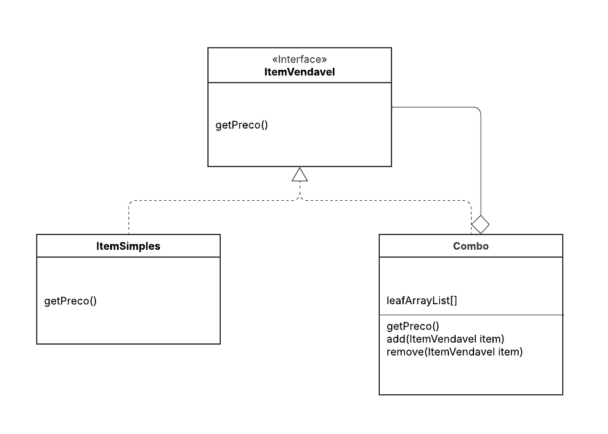

# 3.2.1. Composite

## Introdução

Este documento tem como objetivo apresentar a aplicação do padrão de projeto Composite, um dos padrões GoF (Gang of Four), no contexto do sistema (GAMMA et al., 1994). O padrão Composite pertence à categoria dos padrões Estruturais.

Sua intenção principal, conforme descrito pelo Refactoring Guru (2025), é "permitir que você componha objetos em estruturas de árvore e então trabalhe com essas estruturas como se fossem objetos individuais". Ou seja, ele permite que os clientes tratem de maneira uniforme objetos individuais (folhas) e composições de objetos (compostos) (MIRANDA, 2020).


## Metodologia

Com base no escopo do sistema e no objetivo do padrão Composite, foram analisadas diversas áreas do projeto que apresentam hierarquias "parte-todo" (GAMMA et al., 1994). A avaliação considerou a necessidade de tratar uniformemente objetos individuais (folhas) e coleções de objetos (compostos) (REFACTORING GURU, 2025).

Durante o processo de análise, foram considerados os seguintes candidatos ao uso de Composite:

1.  **Cardápio (Itens Simples vs. Combos):** Para tratar um item individual (ex: "Refrigerante") e um combo (ex: "Lanche + Batata") da mesma forma no carrinho ou no pedido, algo análogo ao exemplo de `Comida` e `Hamburgue` dos slides (SERRANO,2025).
2.  **Estrutura do Pedido:** Para compor um pedido de múltiplos itens e combos, permitindo que o pedido (Composite) seja tratado como um componente único para cálculo de preço
3.  **Montagem de Itens Personalizados:** Para modelar um item (ex: "Pizza" ou "Açaí") como um composto (`Composite`) de seus ingredientes (`Leafs`), permitindo cálculos dinâmicos.
4.  **Categorias e Subcategorias do Cardápio:** Para criar uma árvore de categorias de menu, onde tanto uma subcategoria (Composite) quanto um item (Leaf) podem ser exibidos de forma recursiva.

Dentre esses, a modelagem do **Cardápio (Itens Simples vs. Combos)** foi selecionada como exemplo prático neste documento. A razão da escolha é que este é um caso clássico e muito intuitivo do padrão, diretamente análogo aos exemplos de `Comida` (`Hamburgue`) e `Path` (Caminho) apresentados na aula (SERRANO,2025). Ele permite que o "Carrinho de Compras" ou o "Módulo de Pedidos" trate todos os elementos de forma idêntica, simplificando drasticamente a lógica de cálculo de totais.


## Desenvolvimento

No projeto **Pode Pedir FCTE**, o padrão Composite foi aplicado para modelar a estrutura de itens do cardápio. Isso nos permite criar uma árvore de objetos onde tanto os "nós" (itens compostos, como combos) quanto as "folhas" (itens individuais) implementam a mesma interface.

### Estrutura do Composite no Projeto

A estrutura segue a modelagem genérica apresentada pela literatura (GAMMA et al., 1994):

* **Component:** É a interface (`ItemVendavel`) que define as operações comuns a todos os elementos da composição, como `getPreco()`.
* **Leaf:** Representa os objetos "folha" (`ItemSimples`), que não possuem filhos. Eles implementam diretamente a operação `getPreco()`, retornando seu próprio valor.
* **Composite:** Representa os objetos compostos (`Combo`). Esta classe armazena uma coleção de filhos (`Component`) e implementa os métodos de gerenciamento (como `add()` e `remove()`). A sua implementação da operação `getPreco()` itera sobre todos os seus filhos, chama o `getPreco()` de cada um recursivamente e retorna a soma total.
```

A implementação foi feita utilizando o framework **NodeJs** com **completar**.  **completar**, 


##### Código Aplicado


```ts

Código...

```


<font size="2"><p style="text-align: center"><b>Figura 1:</b> Diagrama de classes representando o padrão Singleton (GoF)</p></font>


<div style="text-align: center;">





</div>


<font size="2"><p style="text-align: center"><b>Autor:</b> <a href="https://github.com/...">Nome</a>, 2025</p></font> 
 ## Demonstração do Código sendo Executado


- [Execução do Código](...)</br>

Participantes: ...</br>

- [Repositório do Codigo](...)


## Conclusão

A aplicação do padrão Composite no projeto **Pode Pedir FCTE** demonstrou-se uma decisão de design acertada para gerenciar as hierarquias de produtos. A principal vantagem, conforme o objetivo do padrão, foi a capacidade de tratar objetos individuais (Leafs) e composições (Composites) de maneira uniforme (GAMMA et al., 1994).

Isso simplifica drasticamente o código cliente (REFACTORING GURU, 2025). Para calcular o valor total de um pedido, o módulo "Carrinho de Compras" não precisa de condicionais (`if-else`) para verificar se um item é um "Combo" ou um "Item simples". Ele apenas itera sobre sua lista de `Componentes` e invoca a operação `getPreco()` em cada um, tratando todos da mesma maneira.


## Bibliografia

> Refactoring Guru. *Composite*. Disponível em: [https://refactoring.guru/pt-br/design-patterns/composite](https://refactoring.guru/pt-br/design-patterns/composite). Acesso em: 21 de outubro 2025.

> SERRANO, Milene. AULA - GOFS ESTRUTURAIS. Slides. Universidade de Brasília, 2025. Acesso em: 21 de outubro 2025.

> GAMMA, Erich; HELM, Richard; JOHNSON, Ralph; VLISSIDES, John. *Design Patterns: Elements of Reusable Object-Oriented Software*. Addison-Wesley, 1994.

>MIRANDA, Otávio. **Composite Teoria - Padrões de Projeto - Parte 14/45**. [S. l.]: [s. n.], 24 ago. 2020. 1 vídeo (16 min 6 s). Disponível em: [http://www.youtube.com/watch?v=I0RqHDFQjVY](http://www.youtube.com/watch?v=I0RqHDFQjVY). Acesso em: 21 out. 2025.

## Histórico de Versões

| Versão | Data       | Descrição                                                             | Autor(es)                                      | Revisor(es) | Detalhes da revisão |
| ------ | ---------- | --------------------------------------------------------------------- | ---------------------------------------------- | ----------- | ------------------- |
| 1.0    | 06/10/2025 | Inicialização do Documento com Introdução, Metodologia e Bibliografia | [Cayo Alencar](https://github.com/Cayoalencar)     |     [Nathan Batista](https://github.com/Nathan-bs)   |  A estrutura se demonstrou coerente para a inclusão dos conteúdos no projeto.  
| 1.1    | 23/10/2025 | Adiciona diagrama de classes composite | [Nathan Batista](https://github.com/Nathan-bs)     |         |                
