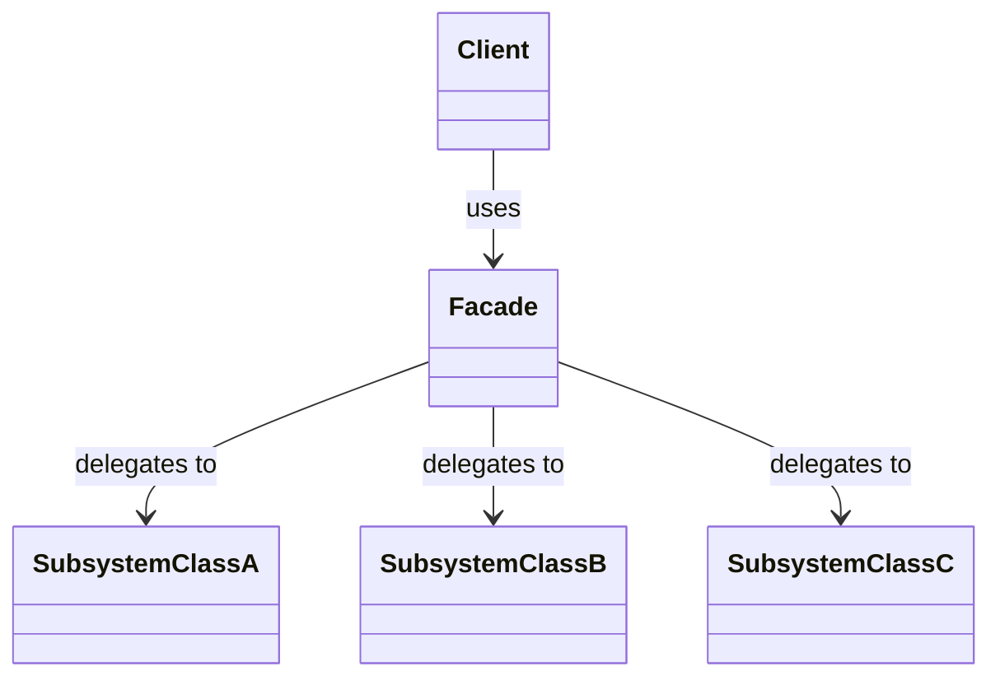

# 3.2.5. Facade

O padrão **Facade** (Fachada) é um padrão de projeto estrutural que fornece uma interface simplificada e unificada para um conjunto de interfaces de um subsistema complexo. A intenção é ocultar a complexidade do sistema e fornecer ao cliente uma interface de alto nível que torna o subsistema mais fácil de usar.

## 1. Contexto no Projeto "PodePedirFCTE"

No projeto **PodePedirFCTE**, uma operação como "finalizar um pedido" envolve múltiplos passos: calcular o total, aplicar descontos, processar o pagamento via cartão de crédito, registrar a transação no banco de dados e notificar a cozinha. Essa lógica complexa, que pode ser vista no nosso **[Diagrama de Atividades](/Modelagem/ModelagemDinamica/DiagramaDeAtividades.md)**, pode ser simplificada.

Podemos criar uma `PedidoFacade` que expõe um único método, como `processarPedido()`. O cliente (a interface do usuário, por exemplo) só precisa chamar este método, e a *facade* se encarrega de coordenar as chamadas para os diferentes componentes do subsistema (`ServicoDePagamento`, `GestorDeEstoque`, `NotificadorCozinha`, etc.), reduzindo o acoplamento e simplificando o código do cliente.

## 2. Estrutura

O padrão Facade é composto por:

- **Facade (Fachada):** A classe que fornece a interface simplificada. Ela conhece os componentes do subsistema e delega as chamadas do cliente para eles.
- **Subsistema:** O conjunto de classes complexas que a *facade* encapsula. Os clientes podem, opcionalmente, acessar essas classes diretamente, mas geralmente usam a *facade*.
- **Cliente:** A classe que utiliza a *facade* para interagir com o subsistema.

O diagrama abaixo ilustra essa relação:



## 3. Exemplo de Implementação

O material de apoio nos fornece um exemplo clássico: ligar um computador. A complexidade de interagir com a CPU, Memória e Hard Drive é encapsulada por uma `ComputadorFacade`.

### 3.1. Classes do Subsistema

Estas são as classes complexas que realizam o trabalho de baixo nível.

```cpp
// Arquivo: Cpu.h
#ifndef CPU_H
#define CPU_H

#include <iostream>

class Cpu {
public:
   void start() {
      std::cout << "inicialização inicial" << std::endl;
   }
   void execute() {
      std::cout << "executa algo no processador" << std::endl;
   }
   void load() {
      std::cout << "carrega registrador" << std::endl;
   }
   void free() {
      std::cout << "libera registradores" << std::endl;
   }
};

#endif // CPU_H
```

```cpp
// Arquivo: Memoria.h
#ifndef MEMORIA_H
#define MEMORIA_H

#include <iostream>
#include <string>

class Memoria {
public:
   void load(int position, const std::string& info) {
      std::cout << "carrega dados na memória" << std::endl;
   }
   void free(int position, const std::string& info) {
      std::cout << "libera dados da memória" << std::endl;
   }
};

#endif // MEMORIA_H
```

```cpp
// Arquivo: HardDrive.h
#ifndef HARD_DRIVE_H
#define HARD_DRIVE_H

#include <iostream>
#include <string>

class HardDrive {
public:
   std::string read(int startPosition, int size) {
      std::cout << "lê dados do HD" << std::endl;
      return "DADOS_DO_BOOT";
   }
   void write(int position, const std::string& info) {
      std::cout << "escreve dados no HD" << std::endl;
   }
};

#endif // HARD_DRIVE_H
```

### 3.2. A Classe Facade

Esta classe fornece o método simplificado `ligarComputador()`, que orquestra as chamadas para os componentes do subsistema.

```cpp
// Arquivo: ComputadorFacade.h
#ifndef COMPUTADOR_FACADE_H
#define COMPUTADOR_FACADE_H

#include "Cpu.h"
#include "Memoria.h"
#include "HardDrive.h"

class ComputadorFacade {
public:
   ComputadorFacade() : cpu(), memoria(), hardDrive() {}

   void ligarComputador() {
      const int BOOT_ADDRESS = 0;
      const int BOOT_SECTOR = 0;
      const int SECTOR_SIZE = 512;

      cpu.start();
      std::string hdBootInfo = hardDrive.read(BOOT_SECTOR, SECTOR_SIZE);
      memoria.load(BOOT_ADDRESS, hdBootInfo);
      cpu.execute();
      memoria.free(BOOT_ADDRESS, hdBootInfo);
   }

private:
   Cpu cpu;
   Memoria memoria;
   HardDrive hardDrive;
};

#endif // COMPUTADOR_FACADE_H
```

### 3.3. Arquivo Principal (main)

Este arquivo utiliza a `ComputadorFacade` para interagir com o sistema de forma simplificada.

```cpp
// Arquivo: main.cpp
#include "ComputadorFacade.h"

int main() {
    ComputadorFacade computador;
    computador.ligarComputador();
    return 0;
}
```

### 3.4. Estrutura de Arquivos

A organização dos arquivos em um projeto C++ ficaria da seguinte forma:

```
Implementacoes_Entrega3_Arquitetura/
└── facade/
    ├── Cpu.h
    ├── Memoria.h
    ├── HardDrive.h
    ├── ComputadorFacade.h
    └── main.cpp
```

## 4. Vantagens

- **Reduz o acoplamento:** Desacopla o cliente das classes do subsistema. Mudanças no subsistema podem exigir apenas alterações na *facade*, e não nos clientes.
- **Simplifica o uso:** Fornece uma interface mais simples e intuitiva para funcionalidades complexas.
- **Organiza o sistema:** Promove a divisão do sistema em camadas, onde a *facade* é o ponto de entrada para uma camada de serviço.

## 5. Referências

- FREEMAN, Eric et al. **Head First Design Patterns**. O'Reilly Media, 2004.
- GAMMA, Erich et al. **Design Patterns: Elements of Reusable Object-Oriented Software**. Addison-Wesley, 1995.

## Histórico de Versões

| **Data**       | **Versão** | **Descrição**                      | **Autor**                                     | **Revisor** | **Data da Revisão** |
| :--------: | :----: | :--------------------------------- | :---------------------------------------: | :---------: | :-------------: |
| 24/10/2025 |  `1.0`   | Criação do artefato do Facade.     | [Ana Joyce](https://github.com/anajoyceamorim) |             |                 |
