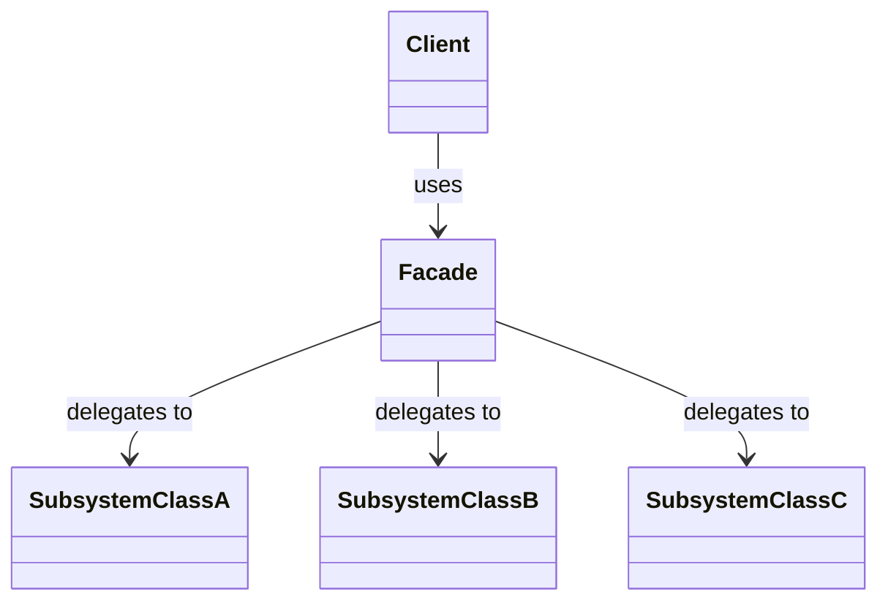

# 3.2.5. Facade

O padrão **Facade** (Fachada) é um padrão de projeto estrutural que fornece uma interface simplificada e unificada para um conjunto de interfaces de um subsistema complexo. A intenção é ocultar a complexidade do sistema e fornecer ao cliente uma interface de alto nível que torna o subsistema mais fácil de usar.

## 1. Contexto no Projeto "PodePedir!"

No projeto **[PodePedir!](/Projeto/Projeto.md)**, uma operação como "finalizar um pedido" envolve múltiplos passos: calcular o total, aplicar descontos, processar o pagamento via cartão de crédito, registrar a transação no banco de dados e notificar a cozinha. Essa lógica complexa, que pode ser vista no nosso **[Diagrama de Atividades](/Modelagem/ModelagemDinamica/DiagramaDeAtividades.md)**, pode ser simplificada.

Podemos criar uma `PedidoFacade` que expõe um único método, como `processarPedido()`. O cliente (a interface do usuário, por exemplo) só precisa chamar este método, e a *facade* se encarrega de coordenar as chamadas para os diferentes componentes do subsistema (`ServicoDePagamento`, `GestorDeEstoque`, `NotificadorCozinha`, etc.), reduzindo o acoplamento e simplificando o código do cliente.

## 2. Estrutura

O padrão Facade é composto por:

- **Facade (Fachada):** A classe que fornece a interface simplificada. Ela conhece os componentes do subsistema e delega as chamadas do cliente para eles.
- **Subsistema:** O conjunto de classes complexas que a *facade* encapsula. Os clientes podem, opcionalmente, acessar essas classes diretamente, mas geralmente usam a *facade*.
- **Cliente:** A classe que utiliza a *facade* para interagir com o subsistema.

O diagrama abaixo ilustra essa relação:



## 3. Exemplo de Implementação

O material de apoio nos fornece um exemplo clássico: ligar um computador. A complexidade de interagir com a CPU, Memória e Hard Drive é encapsulada por uma `ComputadorFacade`.

### 3.1. Classes do Subsistema

Estas são as classes complexas que realizam o trabalho de baixo nível.

```java
// Arquivo: Cpu.java
public class Cpu {
   public void start() {
      System.out.println("inicialização inicial");
   }
   public void execute() {
      System.out.println("executa algo no processador");
   }
   public void load() {
      System.out.println("carrega registrador");
   }
   public void free() {
      System.out.println("libera registradores");
   }
}

// Arquivo: Memoria.java
public class Memoria {
   public void load(int position, String info) {
      System.out.println("carrega dados na memória");
   }
   public void free(int position, String info) {
      System.out.println("libera dados da memória");
   }
}

// Arquivo: HardDrive.java
public class HardDrive {
   public void read(int startPosition, int size) {
      System.out.println("lê dados do HD");
   }
   public void write(int position, String info) {
      System.out.println("escreve dados no HD");
   }
}
```

### 3.2. A Classe Facade

Esta classe fornece o método simplificado `ligarComputador()`, que orquestra as chamadas para os componentes do subsistema.

```java
// Arquivo: ComputadorFacade.java
public class ComputadorFacade {
   private Cpu cpu = null;
   private Memoria memoria = null;
   private HardDrive hardDrive = null;

   public ComputadorFacade() {
      this.cpu = new Cpu();
      this.memoria = new Memoria();
      this.hardDrive = new HardDrive();
   }

   public void ligarComputador() {
      // Supondo que estas constantes existem
      int BOOT_ADDRESS = 0;
      int BOOT_SECTOR = 0;
      int SECTOR_SIZE = 512;

      cpu.start();
      // O método read do HardDrive no exemplo não retorna nada, mas para o fluxo fazer sentido, 
      // vamos assumir que ele retornaria os dados lidos.
      // String hdBootInfo = hardDrive.read(BOOT_SECTOR, SECTOR_SIZE);
      hardDrive.read(BOOT_SECTOR, SECTOR_SIZE);
      String hdBootInfo = "DADOS_DO_BOOT"; // Simulação
      memoria.load(BOOT_ADDRESS, hdBootInfo);
      cpu.execute();
      memoria.free(BOOT_ADDRESS, hdBootInfo);
   }
}
```

### 3.3. Estrutura de Arquivos

A organização dos arquivos em um projeto Java ficaria da seguinte forma:

```
src/
└── main/
    └── java/
        └── com/
            └── exemplo_facade/
                ├── subsistema/
                │   ├── Cpu.java
                │   ├── Memoria.java
                │   └── HardDrive.java
                ├── ComputadorFacade.java
                └── Main.java
```

## 4. Vantagens

- **Reduz o acoplamento:** Desacopla o cliente das classes do subsistema. Mudanças no subsistema podem exigir apenas alterações na *facade*, e não nos clientes.
- **Simplifica o uso:** Fornece uma interface mais simples e intuitiva para funcionalidades complexas.
- **Organiza o sistema:** Promove a divisão do sistema em camadas, onde a *facade* é o ponto de entrada para uma camada de serviço.

## 5. Referências

- FREEMAN, Eric et al. **Head First Design Patterns**. O'Reilly Media, 2004.
- GAMMA, Erich et al. **Design Patterns: Elements of Reusable Object-Oriented Software**. Addison-Wesley, 1995.

## Histórico de Versões

| **Data**       | **Versão** | **Descrição**                      | **Autor**                                     | **Revisor** | **Data da Revisão** |
| :--------: | :----: | :--------------------------------- | :---------------------------------------: | :---------: | :-------------: |
| 24/10/2025 |  `1.0`   | Criação do artefato do Facade.     | [Ana Joyce](https://github.com/anajoyceamorim) |             |                 |
