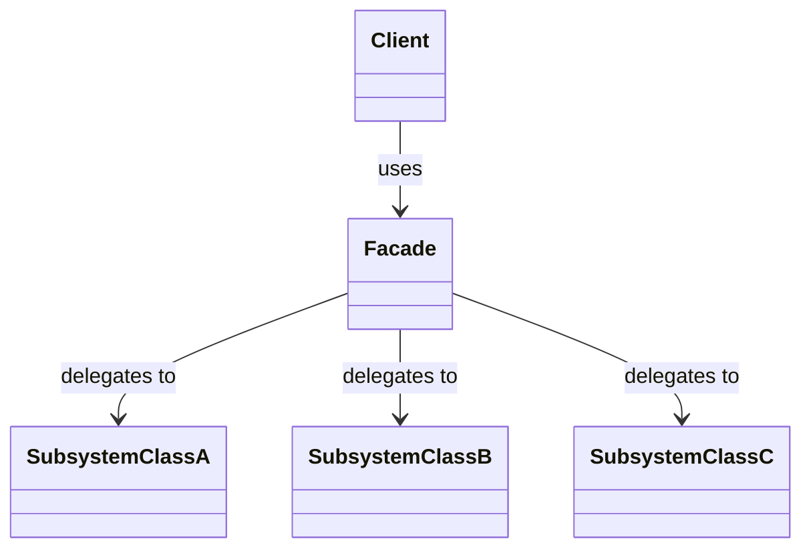

# 3.2.5. Facade

O padrão **Facade** (Fachada) é um padrão de projeto estrutural que fornece uma interface simplificada e unificada para um conjunto de interfaces de um subsistema complexo. A intenção é ocultar a complexidade do sistema e fornecer ao cliente uma interface de alto nível que torna o subsistema mais fácil de usar.

## 1. Contexto no Projeto "PodePedirFCTE"

No projeto **PodePedirFCTE**, uma ação aparentemente simples como "finalizar um pedido" dispara uma série de operações complexas em diferentes partes do sistema. O usuário clica em um botão, mas por trás das cenas, o aplicativo precisa:

1.  **Processar o Pagamento:** Comunicar-se com um sistema de pagamento para autorizar o cartão de crédito do usuário.
2.  **Verificar o Estoque:** Checar com o restaurante se os itens do pedido ainda estão disponíveis.
3.  **Registrar o Pedido:** Salvar os detalhes do pedido no banco de dados do nosso sistema.
4.  **Notificar a Cozinha:** Enviar uma notificação para o restaurante começar a preparar o pedido.

Expor toda essa complexidade para a interface do usuário (a tela de checkout, por exemplo) seria problemático. O código da UI ficaria cheio de responsabilidades que não são dele, e qualquer mudança em um desses subsistemas (como trocar o provedor de pagamento) exigiria alterações na UI.

É aqui que o padrão **Facade** se encaixa perfeitamente. Podemos criar uma `PedidoFacade` que atua como uma "fachada" ou um ponto de entrada simplificado para toda essa lógica. A UI simplesmente chama um único método, como `pedidoFacade.realizarPedido()`, e a facade se encarrega de orquestrar as chamadas para os diferentes subsistemas (`SistemaDePagamento`, `SistemaDeEstoque`, `BancoDeDados`, etc.) na ordem correta.

**Vantagens no PodePedirFCTE:**
-   **Simplifica o código do cliente:** A UI só precisa conhecer a `PedidoFacade`.
-   **Desacopla o cliente dos subsistemas:** Podemos trocar o sistema de pagamento ou a forma de notificar a cozinha sem precisar alterar o código da UI.
-   **Centraliza a lógica de negócio:** A orquestração do processo de pedido fica em um único lugar, tornando o fluxo mais fácil de entender e manter.

## 2. Estrutura

O padrão Facade é composto por:

- **Facade (Fachada):** A classe que fornece a interface simplificada. Ela conhece os componentes do subsistema e delega as chamadas do cliente para eles.
- **Subsistema:** O conjunto de classes complexas que a *facade* encapsula. Os clientes podem, opcionalmente, acessar essas classes diretamente, mas geralmente usam a *facade*.
- **Cliente:** A classe que utiliza a *facade* para interagir com o subsistema.

O diagrama abaixo ilustra essa relação:



## 3. Exemplo de Implementação (Contexto: PodePedirFCTE)

Vamos criar uma `PedidoFacade` que simplifica o processo de realizar um pedido, orquestrando os subsistemas de Pagamento, Restaurante e Banco de Dados.

### 3.1. As Classes do Subsistema

Estas são as classes complexas que a nossa Facade irá simplificar. Cada uma representa uma parte do processo de pedido.

```cpp
// Arquivo: SistemaPagamento.h
#ifndef SISTEMA_PAGAMENTO_H
#define SISTEMA_PAGAMENTO_H

#include <iostream>
#include <string>

class SistemaPagamento {
public:
    bool processarPagamento(const std::string& usuario, double valor) {
        std::cout << "[Pagamento] Processando pagamento de R$ " << valor << " para o usuário '" << usuario << "'." << std::endl;
        if (valor > 1000) {
            std::cout << "[Pagamento] ERRO: Limite de crédito excedido." << std::endl;
            return false;
        }
        std::cout << "[Pagamento] Pagamento aprovado!" << std::endl;
        return true;
    }
};

#endif // SISTEMA_PAGAMENTO_H
```

```cpp
// Arquivo: SistemaRestaurante.h
#ifndef SISTEMA_RESTAURANTE_H
#define SISTEMA_RESTAURANTE_H

#include <iostream>
#include <string>
#include <vector>

class SistemaRestaurante {
public:
    bool checarEstoque(const std::vector<std::string>& itens) {
        std::cout << "[Restaurante] Checando estoque para " << itens.size() << " itens." << std::endl;
        for (const auto& item : itens) {
            if (item == "Moqueca de Siri") {
                std::cout << "[Restaurante] ERRO: O item 'Moqueca de Siri' está em falta!" << std::endl;
                return false;
            }
        }
        std::cout << "[Restaurante] Todos os itens estão disponíveis." << std::endl;
        return true;
    }

    void enviarPedido(const std::vector<std::string>& itens) {
        std::cout << "[Restaurante] Pedido enviado para a cozinha. Preparando itens..." << std::endl;
    }
};

#endif // SISTEMA_RESTAURANTE_H
```

```cpp
// Arquivo: SistemaPedido.h
#ifndef SISTEMA_PEDIDO_H
#define SISTEMA_PEDIDO_H

#include <iostream>
#include <string>
#include <vector>

class SistemaPedido {
public:
    void registrarPedido(const std::string& usuario, const std::vector<std::string>& itens) {
        std::cout << "[Pedido DB] Registrando pedido de '" << usuario << "' no banco de dados." << std::endl;
        std::cout << "[Pedido DB] Pedido registrado com sucesso!" << std::endl;
    }
};

#endif // SISTEMA_PEDIDO_H
```

### 3.2. A Classe Facade (`PedidoFacade`)

Esta é a classe central do padrão. Ela conhece os subsistemas e os utiliza na ordem correta para executar a tarefa de `realizarPedido`.

```cpp
// Arquivo: PedidoFacade.h
#ifndef PEDIDO_FACADE_H
#define PEDIDO_FACADE_H

#include "SistemaPagamento.h"
#include "SistemaRestaurante.h"
#include "SistemaPedido.h"
#include <string>
#include <vector>
#include <iostream>

class PedidoFacade {
private:
    SistemaPagamento pagamento;
    SistemaRestaurante restaurante;
    SistemaPedido pedidoDB;

public:
    bool realizarPedido(const std::string& usuario, const std::vector<std::string>& itens, double valorTotal) {
        std::cout << "\n--- Iniciando processo de pedido para '" << usuario << "' ---" << std::endl;

        if (!restaurante.checarEstoque(itens)) {
            std::cout << "--- Processo de pedido falhou: Itens em falta. ---" << std::endl;
            return false;
        }

        if (!pagamento.processarPagamento(usuario, valorTotal)) {
            std::cout << "--- Processo de pedido falhou: Pagamento recusado. ---" << std::endl;
            return false;
        }

        pedidoDB.registrarPedido(usuario, itens);

        restaurante.enviarPedido(itens);

        std::cout << "\n[Notificação] Olá, " << usuario << "! Seu pedido foi realizado com sucesso e já está sendo preparado!"
                  << std::endl;
        std::cout << "--- Processo de pedido finalizado com sucesso! ---" << std::endl;
        return true;
    }
};

#endif // PEDIDO_FACADE_H
```

### 3.3. O Cliente (Demonstração)

O cliente (a UI, por exemplo) só precisa interagir com a `PedidoFacade`, simplificando drasticamente seu código.

```cpp
// Arquivo: main.cpp
#include "PedidoFacade.h"

int main() {
    PedidoFacade pedidoFacade;

    // Pedido 1: Deve funcionar
    std::vector<std::string> itens1 = {"Pizza de Calabresa", "Refrigerante"};
    pedidoFacade.realizarPedido("Ana Joyce", itens1, 55.00);

    std::cout << "\n=====================================================\n";

    // Pedido 2: Deve falhar por falta de estoque
    std::vector<std::string> itens2 = {"Moqueca de Siri", "Água de Coco"};
    pedidoFacade.realizarPedido("Carlos", itens2, 95.00);

    return 0;
}
```

**Saída:**
```
--- Iniciando processo de pedido para 'Ana Joyce' ---
[Restaurante] Checando estoque para 2 itens.
[Restaurante] Todos os itens estão disponíveis.
[Pagamento] Processando pagamento de R$ 55.00 para o usuário 'Ana Joyce'.
[Pagamento] Pagamento aprovado!
[Pedido DB] Registrando pedido de 'Ana Joyce' no banco de dados.
[Pedido DB] Pedido registrado com sucesso!
[Restaurante] Pedido enviado para a cozinha. Preparando itens...

[Notificação] Olá, Ana Joyce! Seu pedido foi realizado com sucesso e já está sendo preparado!
--- Processo de pedido finalizado com sucesso! ---

=====================================================

--- Iniciando processo de pedido para 'Carlos' ---
[Restaurante] Checando estoque para 2 itens.
[Restaurante] ERRO: O item 'Moqueca de Siri' está em falta!
--- Processo de pedido falhou: Itens em falta. ---
```

### 3.4. Estrutura de Arquivos

A nova estrutura de arquivos para este exemplo fica assim:

```
Implementacoes_Entrega3_Arquitetura/
└── facade_pedido/
    ├── SistemaPagamento.h
    ├── SistemaRestaurante.h
    ├── SistemaPedido.h
    ├── PedidoFacade.h
    └── main.cpp
```

## 4. Vantagens

- **Reduz o acoplamento:** Desacopla o cliente das classes do subsistema. Mudanças no subsistema podem exigir apenas alterações na *facade*, e não nos clientes.
- **Simplifica o uso:** Fornece uma interface mais simples e intuitiva para funcionalidades complexas.
- **Organiza o sistema:** Promove a divisão do sistema em camadas, onde a *facade* é o ponto de entrada para uma camada de serviço.

## Apresentação

<iframe width="853" height="480" src="https://www.youtube.com/embed/X1ZcvnFE77c" title="Iterator" frameborder="0" allow="accelerometer; autoplay; clipboard-write; encrypted-media; gyroscope; picture-in-picture; web-share" referrerpolicy="strict-origin-when-cross-origin" allowfullscreen></iframe>

## Quadro de Participações

| **Membro da equipe** | **Função** |
| :------------- | :--------- |
| [Ana Joyce](https://github.com/anajoyceamorim) | Documentação e implementação do gof Facade|

## 5. Referências

- FREEMAN, Eric et al. **Head First Design Patterns**. O'Reilly Media, 2004.
- GAMMA, Erich et al. **Design Patterns: Elements of Reusable Object-Oriented Software**. Addison-Wesley, 1995.

## Histórico de Versões

| **Data**       | **Versão** | **Descrição**                      | **Autor**                                     | **Revisor** | **Data da Revisão** |
| :--------: | :----: | :--------------------------------- | :---------------------------------------: | :---------: | :-------------: |
| 24/10/2025 |  `1.0`   | Criação do artefato do Facade.     | [Ana Joyce](https://github.com/anajoyceamorim) |   [Ana Clara](https://github.com/anabborges)          |     24/10/2025            |
