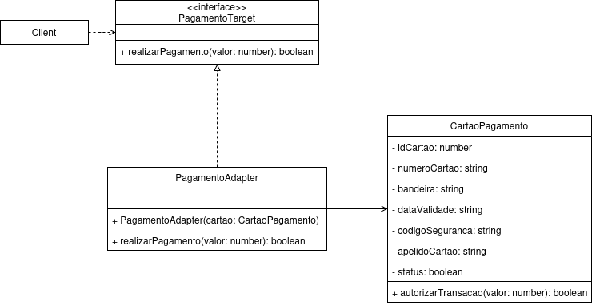

# Adapter

## Introdução
Este documento explica o padrão de projeto estrutural Adapter e apresenta a sua aplicação no **PodePedirFCTE**, desenvolvida com base no diagrama de classes elaborado pela equipe, a partir do qual foram construídas a modelagem e a implementação do padrão.

## Explicação

[explicação do padrão]: #

o padrão estrutural Adapter tem como finalidade converter a interface de uma classe em outra forma compatível com a esperada pelo cliente. Dessa maneira, o padrão possibilita a cooperação entre classes que, de outra forma, não poderiam interagir devido à incompatibilidade entre suas interfaces (GAMMA et al., 1994).

[pode criar novas seções aqui se necessário com ###, por exemplo: Vantagens, Desvantagens]: #

### Estrutura e interações
O padrão Adapter é constituído por quatro participantes principais, sendo elas *Adapter*, *Adaptee*, *Client* e *Target* (GAMMA et al., 1994). Dessa forma, segue a descrição de cada participante e o fluxo de interação esperado entre cada um:

| **Elemento** | **Descrição** |
| :----------- | :------------ |
| *Adaptee* | Classe que possui uma interface pré-existente e incompatível com a esperada pelo Client, mas que contém a funcionalidade desejada. | 
| *Adapter* | Classe/interface responsável por converter a interface do Adaptee para o formato definido por Target. |
| *Client* | Interface/classe que utiliza objetos compatíveis com a interface Target e depende dela para executar suas operações.| 
| *Target* | Estabelece uma interface/classe de domínio que será utilizada pelo Client.|

O fluxo de interação entre esses componentes ocorre da seguinte maneira:

**1.** O Client invoca operações sobre uma instância do Adapter para solicitar determinada funcionalidade;

**2.** O Adapter interpreta a solicitação e a converte em uma forma compatível com a interface do Adaptee;

**3.** O Adapter chama as operações correspondentes do Adaptee, que executa efetivamente a requisição.

**4.** O resultado é retornado ao Client, o que estabelece a integração entre interfaces antes incompatíveis.

### Aplicabilidade
A partir do que foi expresso por Gamma et al. (1994), o padrão Adapter é indicado quando se deseja empregar uma classe já existente cuja interface não corresponde à necessária, ou quando é preciso desenvolver uma classe reutilizável capaz de colaborar com outras não relacionadas ou originalmente imprevistas. Além disso, o padrão é adequado em situações em que há diversas subclasses existentes, mas seria inviável adaptar a interface de cada uma individualmente.

### Vantagens e desvantagens
Como apresentado por Refactoring.Guru (2019?), o padrão apresenta duas vantagens e uma desvantagem em relação à sua aplicação prática. Dessa forma, as vantagens identificadas são:
- separação de interface da lógica geral de negócio do programa;
- introdução de novos tipos de adaptadores em seu programa sem que haja erro de execução do código do cliente.

Contudo, a desvantagem observada é que a complexidade do código aumenta ao decorrer da adição de novos conjuntos de interfaces e classes.

## Aplicação no projeto

A aplicação do padrão Adapter no **PodePedirFCTE** envolveu a sua modelagem UML e implementação de sua codificação a partir dessa modelagem.  

### Modelagem

No que se refere ao processo de análise de informações para confecção do artefato, foram levados em consideração os seguintes pontos da segunda entrega:

- [Diagrama de classes](https://unbarqdsw2025-2-turma01.github.io/2025.2-T01-G7_PodePedirFCTE_Entrega_02/#/./Modelagem/ModelagemEstatica/DiagramaDeClasses):

A figura 1 abaixo representa o diagrama que modela o padrão Adapter. 

<div align="center">

**Figura 1** – Diagrama UML do padrão Adapter do projeto PodePedirFCTE 

  

**Autor: [`@Willian`](https://github.com/Wooo589)**, 2025

</div>

#### Comentários sobre a modelagem

Ao analisar o trecho do diagrama relacionado ao sistema de pagamentos, fiz uma adaptação didática para viabilizar a aplicação do padrão Adapter sem comprometer a coerência estrutural do modelo. O objetivo foi demonstrar como a classe existente `CartaoPagamento` pôde ser reutilizada em um novo contexto, no papel de sistema legado responsável pela autorização de transações.

A adaptação incluiu a criação da interface `PagamentoTarget`, que define o contrato esperado pelo cliente, e da classe `PagamentoAdapter`, que converte as chamadas do cliente para o formato aceito pela classe existente. Dessa forma, a modelagem evidencia a capacidade do padrão de integrar componentes originalmente incompatíveis, preserva o encapsulamento e mantém a fidelidade à proposta do diagrama original.

### Implementação

A implementação do padrão Adapter no **PodePedirFCTE** está organizada em uma estrutura de diretórios que reflete claramente os componentes do padrão:

```
adapter/
├── src/
|   ├── CartaoPagamento.ts      # Adaptee
|   ├── PagamentoTarget.ts      # Target 
|   ├── PagamentoAdapter.ts     # Adapter
|   └── demo.ts                 # Client
```

#### Estrutura da implementação

A implementação do padrão Adapter no **PodePedirFCTE** foi desenvolvida através do Object Adapter Pattern, sendo que sua inserção foi adaptado ao contexto do sistema de pagamentos. 

##### **1. Interface PagamentoTarget (Target)**

```typescript
export interface PagamentoTarget {
    realizarPagamento(valor: number): boolean;
}
```

A interface define o contrato esperado pelo cliente (no caso, o sistema de checkout ou ponto de venda).
Qualquer classe que implemente esta interface pode ser utilizada para processar pagamentos, independentemente de como a transação é realmente executada.

##### **2. Classe CartaoPagamento (Adaptee)**

```typescript
export class CartaoPagamento {
    private numeroCartao: string;
    private codigoSeguranca: string;
    private status: boolean;
    // {outros atributos da classe}

    constructor(
        numeroCartao: string, codigoSeguranca: string, status: boolean
    // {outras nomeações do construtor}
    ) {
        this.numeroCartao = numeroCartao;
        this.codigoSeguranca = codigoSeguranca;
        this.status = status;
    }

    public autorizarTransacao(valor: number): boolean {
        console.log(`Autorizando transação no cartão ${this.numeroCartao} no valor de R$${valor}...`);

        if (!this.status) {
            console.log("Falha: o cartão está inativo ou bloqueado.");
            return false;
        }

        if (this.codigoSeguranca.length !== 3) {
            console.log("Falha: código de segurança inválido.");
            return false;
        }

        console.log("Transação autorizada com sucesso!");
        return true;
    }
}
```
A classe `CartaoPagamento` representa o Adaptee, ou seja, uma classe existente com uma interface incompatível com a esperada pelo sistema de pagamentos.
Ela possui o método `autorizarTransacao()`, que processa a transação diretamente, mas com assinatura diferente do método `realizarPagamento()` esperado.

##### **3. Classe PagamentoAdapter (Adapter)**

```typescript
export class PagamentoAdapter implements PagamentoTarget {
  private cartao: CartaoPagamento;

  constructor(cartao: CartaoPagamento) {
    this.cartao = cartao;
  }

  realizarPagamento(valor: number): boolean {
    console.log("Adaptando chamada para o CartaoPagamento...");
    return this.cartao.autorizarTransacao(valor);
  }
}
```

A classe `PagamentoAdapter` implementa a interface `PagamentoTarget` e atua como um conector entre o cliente e o `CartaoPagamento`.
Ela traduz as chamadas do método `realizarPagamento()` para `autorizarTransacao()`, permitindo o uso do cartão sem modificar sua implementação original.

##### Ferramentas e Tecnologias Utilizadas

- **TypeScript 5.0+**: Linguagem principal que proporciona tipagem estática
- **Node.js**: Runtime para execução do código
- **ts-node**: Para execução direta de arquivos TypeScript durante desenvolvimento
- **npm**: Gerenciamento de dependências e scripts de build

#### Demonstração Prática

O arquivo `demo.ts` demonstra o uso completo do padrão:

```typescript

// Cartão aprovado
const cartao1 = new CartaoPagamento(
    1, 
    //  {continuação...}
    "678", 
    "Fagundes N. P. Santana", 
    true
);

// cartão bloqueado
const cartao3 = new CartaoPagamento(
  2,
  //  {continuação...}
  "444",
  "Fagundes Nogueira P. S.",
  false 
);

const adapter1: PagamentoTarget = new PagamentoAdapter(cartao1);
const sucesso1 = adapter1.realizarPagamento(550.0);
console.log(sucesso1 ? "Pagamento aprovado!\n" : "Pagamento recusado!\n");

// {continuação da implementação do adapter}

const adapter3: PagamentoTarget = new PagamentoAdapter(cartao3);
const sucesso3 = adapter3.realizarPagamento(1500.0);
console.log(sucesso3 ? "Pagamento aprovado!\n" : "Pagamento recusado!\n");

// {continuação da implementação do adapter}
```
O cliente (demo.ts) interage somente com a interface `PagamentoTarget`, sem precisar conhecer detalhes internos do `CartaoPagamento`.
O Adapter cuida de converter as chamadas adequadamente, mantendo o sistema flexível e extensível para novos tipos de pagamento.

### Instruções para Execução do Código

Para executar e testar a implementação do padrão Adapter no **PodePedirFCTE**, siga os passos abaixo:

#### Passos para Execução

**1. Clone o repositório e navegue para o diretório do projeto:**

```bash
git clone https://github.com/UnBArqDsw2025-2-Turma01/2025.2-T01-G7_PodePedirFCTE_Entrega_03.git
cd 2025.2-T01-G7_PodePedirFCTE_Entrega_03/adapter
```

**2. Instale as dependências do projeto:**

```bash
npm install
```

**3. Para compilar o TypeScript para JavaScript:**

```bash
npm run build
```

**4. Execute o projeto em modo de desenvolvimento:**

```bash
npm run dev
```


**5. Para executar o código compilado:**

```bash
npm start
```

**6. Para limpar os arquivos compilados:**

```bash
npm run clean
```

#### Scripts Disponíveis

O projeto inclui os seguintes scripts no `package.json`:

- `npm run dev`: Executa o código TypeScript diretamente usando ts-node
- `npm run build`: Compila o TypeScript para JavaScript
- `npm start`: Executa o código JavaScript compilado
- `npm run clean`: Remove o diretório `dist/` com os arquivos compilados

#### Saída Esperada

Ao executar `npm run dev`, você deve ver uma saída similar a:

```
Adaptando chamada para o CartaoPagamento...
Autorizando transação no cartão 0123-4567-8901-2345 no valor de R$550...
Transação autorizada com sucesso!
Pagamento aprovado!

Adaptando chamada para o CartaoPagamento...
Autorizando transação no cartão 9876-5432-1098-7654 no valor de R$2200...
Falha: código de segurança inválido.
Pagamento recusado!

Adaptando chamada para o CartaoPagamento...
Autorizando transação no cartão 9876-5432-1098-7654 no valor de R$1500...
Falha: o cartão está inativo ou bloqueado.
Pagamento recusado!
```
Essa saída confirma o funcionamento correto do padrão Adapter, mostrando como o sistema se comunica com diferentes formas de pagamento através de uma interface comum.

#### Comentários sobre a implementação

A implementação reflete a separação entre as responsabilidades: o `CartaoPagamento` executa a lógica de autorização, enquanto o PagamentoAdapter atua como intermediário entre a interface esperada e a classe existente.

O resultado final demonstra a funcionalidade essencial do padrão: permitir a integração de uma classe com interface incompatível sem alterar sua estrutura interna. Além disso, o uso de exemplos práticos de pagamento aprovado e recusado facilita a visualização do comportamento do adapter, o que torna a implementação intuitiva e fiel aos conceitos teóricos do padrão.

### Dificuldades encontradas e soluções

Durante o desenvolvimento, foram encontrados os seguintes desafios que foram solucionados:

**1. Adaptar o modelo de acordo com o diagrama de classes**: O desafio foi adequar o padrão Adapter ao diagrama de classes original. Como solução, após consultar os exemplos do Refactoring.Guru e do TutorialsPoint, identifiquei a possibilidade de aplicar o padrão no contexto do sistema de pagamentos. A partir disso, modelei o Adapter para integrar a classe `CartaoPagamento` a uma interface `PagamentoTarget`.

**2. Gravação de vídeo sobre o padrão**: Devido a limitações de hardware, não foi possível realizar a gravação com explicações complementares sobre o padrão. Como alternativa, optei por registrar de forma detalhada o que aprendi sobre o Adapter, com a inclusão de observações sobre cada etapa desenvolvida na modelagem e implementação do padrão. Por conta disso, observa-se que a documentação dessa seção ficou muito extensa.

## Quadro de participações
| **Membro da equipe**   | **Função** |
| :------------------------------------------- | :-------------------------------------------- |               
| [Willian](https://github.com/Wooo589) | Documentação, explicação do padrão, modelagem UML e codificação |

## Referências

> ADAPTER. _In_: REFACTORING.GURU. [_s.l.: s.n._, 2019?]. Disponível em: https://refactoring.guru/design-patterns/adapter. Acesso em: 22 out. 2025.

> ADAPTER PATTERN. _In_: TUTORIALS POINT. [_s.l.: s.n._, 2013?]. Disponível em: https://www.tutorialspoint.com/design_pattern/adapter_pattern.htm. Acesso em: 23 out. 2025.

> GAMMA, Erich _et al._ **Design Patterns**: elements of reusable object-oriented software. Boston, MA: Addison-Wesley, 1994.

## Histórico de Versões

|  **Data**  | **Versão** | **Descrição**                                                                                                          |                    **Autor**                    |                   **Revisor**                   | **Data da Revisão** |
| :--------: | :--------: | :--------------------------------------------------------------------------------------------------------------------- | :---------------------------------------------: | :---------------------------------------------: | :-----------------: |
| 23/10/2025 |   `0.1`    | Adicionar estrutura inicial da página, introdução e explicação                                                            |    [`@Willian`](https://github.com/Wooo589)     | [`@Willian`](https://github.com/Wooo589) |     24/10/2025      |
| 23/10/2025 |   `0.2`    | Adicionar modelagem UML e implementação do padrão Adapter                                                            |    [`@Willian`](https://github.com/Wooo589)     | [`@Willian`](https://github.com/Wooo589) |     24/10/2025      |
| 24/10/2025 |   `0.3`    | Adicionar documentação da implementação e passo a passo                                                        |    [`@Willian`](https://github.com/Wooo589)     | [`@Willian`](https://github.com/Wooo589) |     24/10/2025      |
| 24/10/2025 |   `0.4`    | Adicionar comentários sobre modelagem e implementação do padrão                                                            |    [`@Willian`](https://github.com/Wooo589)     | [`@Willian`](https://github.com/Wooo589) |     24/10/2025     |
| 24/10/2025 |   `1.0`    | Adicionar versão final da documentação do Adapter                                                            |    [`@Willian`](https://github.com/Wooo589)     | [`@Willian`](https://github.com/Wooo589) |     24/10/2025      |