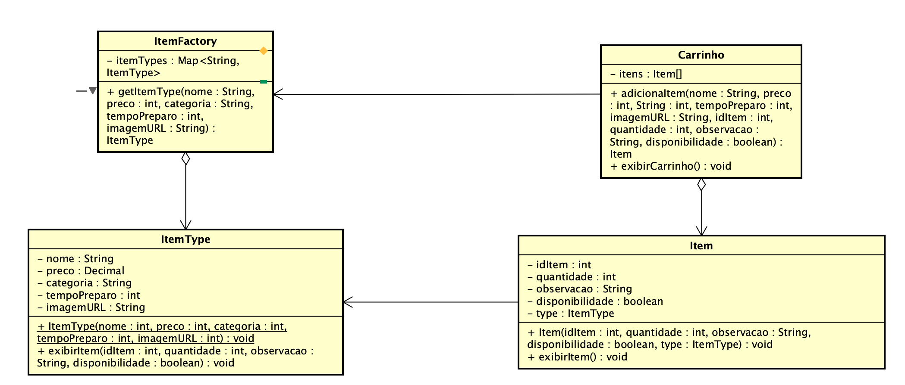

# Flyweight

## Introdução

Esse documento apresenta explicações referentes ao padrão de projeto Flyweight e detalha como ele foi utilizado dentro do projeto Pode Pedir FCTE. 

O padrão Flyweight usa o compartilhamento para oferecer suporte eficiente a um grande número de objetos de granularidade fina.

## Flyweight

O padrão Flyweight é apresentado no livro Design Patterns: Elements of Reusable Object-Oriented Software como um tipo de GOF estrutural. Para isso, ele vem como uma forma de separar uma classe em duas, a primeira contém o Flyweight, sendo utilizado como o objeto compartilhado que pode ser utilizado em múltiplos contextos simultâneamente, ele irá ser responsável por conter o estado intrínssico da objeto original. Por outro lado, vai existir uma outra classe, a qual será responsável por objetos que possuem o estado extrínssico do objeto original. O estado extrínssico depende do contexto que está sendo utilizado e portando não pode ser compartilhado.

Um exemplo motivacional apresentado no livro de Gamma et. al. é com relação aos editores de documentos que utilizando linguagens orientadas a objetos. Ao invés de ter um conjunto enorme de objetos todos para representar a letra "A" por exemplo, é possível pegar as caracteríticas que estão comuns a todos os "A"s e adicioná-las a um Flyweight, o qual vai ser utilizado só uma vez. Já em cenários em que será preciso utilizar um "A" com algum acento, ou com alguma estilização, será usado o Flyweight como base, mas agora adicionando os estados extrínssicos a um novo objeto. Dessa forma, é possível economizar memória RAM, pois os dados do estado intríssico estarão representados na memória apenas uma única vez.

Além disso, no livro os autores discutem algumas aplicabilidades desse padrão de projeto. Para isso, o padrão Flyweight deve ser aplicado quando todos os itens abaixo forem verdade.

- A aplicação usa um grande número de objetos;
- Os custos de armazenamento são altos devido à grande quantidade de objetos;
- A maioria dos estados dos objetos pode ser tornada extrínseca.
- Muitos grupos de objetos podem ser substituídos por relativamente poucos objetos compartilhados uma vez que o estado extrínseco é removido.
- A aplicação não depende da identidade do objeto. Como objetos flyweight
podem ser compartilhados, os testes de identidade retornarão verdadeiro para objetos conceitualmente distintos.

A fim de ter uma explicação mais lúdica e didática, segue a explicação que o site [Refactoring Guru](https://refactoring.guru/) apresenta para explicar a problemática que incentivou a criação do padrão:

O site Refactoring Guru explica esse padrão utilizando um exemplo em que o programador está desenvolvendo um jogo de tiro, que possui um mapa e os jogadores podem atirar nos outros. Quando o programador testou o jogo no seu computador, ele estava funcionando normalmente, contudo, quando mandou para seu amigo testar, o programador descobriu que ele não estava funcionando de forma adequada, estava travando muito.

Então, o progamador descobriu que o problema estava relacionado com o sistema de partículas do jogo. Cada partícula, como uma bala, um míssil ou um pedaço de estilhaços, era representada por um objeto separado contendo muitos dados. Assim, conforme o jogo ia se intensificando, o número de partículas aumentava e consequentemente muitos dados eram colocados na memória RAM. Isso foi que fez com que o jogo no computador do amigo do progamador travasse.

Contudom, ao inspecionar a classe Particula, o programador notou que os campos de cor e sprite consomem muito mais memória do que outros campos. Mas além disso, é que esses dois campos armazenam dados quase idênticos em todas as partículas. Por exemplo, todas as balas têm a mesma cor e sprite. Outras partes do estado de uma partícula, como coordenadas, vetor de movimento e velocidade, são exclusivas de cada partícula. Afinal, os valores desses campos mudam ao longo do tempo. 

Os dados que são constantes de um objeto são chamados de estado intrínseco. Ele vive dentro do objeto; outros objetos só podem lê-lo, não podem alterá-lo. O resto do estado do objeto, muitas vezes alterado “de fora” por outros objetos, é chamado de estado extrínseco.

A partir desse conhecimento, é possivel entender o padrão Flyweight

### Vantagens

- **Economia de memória RAM:** Presumindo que o programa que está sendo rodado apresenta muitas objetos similares, ao aplicar o padrão flyweight é possível pegar todas as caraterísticas que são intríssicas dos objetos e representá-las apenas uma vez. 

### Desvantagens

- **Troca de RAM por ciclos de CPU:** Pode ser que ao utilizar o padrão flyweight você esteja trocando a economia de RAM quando alguns dos dados de contexto precisam ser recalculados toda vez que alguém chama um método flyweight.

- **Aumento de complexidade do código:** Ao utilizar o padrão flyweight o código que está sendo desenvolvido se torna mais complicado. Um dos exemplos que o Refectoring Guru dá para explicar essa desvantagem é com relação a separação de uma classe em duas, uma para os estados intrínssicos e outra para os estados extrínssicos, que a primeira vista pode parecer algo desncessário ou sem sentido.


## Aplicação no projeto

Para o GOF criacional Flyweight foi escolhido trabalhar com a classe de xxx




Além disso, é possível também começar a representação do diagrama em forma de código. Para a construção do código foi escolhido utilizar Java com a IDE Eclipse, já para para a construção do diagrama foi escolhida a ferramenta Astah.


### Classe ItemFactory

```
import java.awt.*;
import java.util.HashMap;
import java.util.Map;

public class ItemFactory {
	
	static Map<String, ItemType> itensTypes = new HashMap<>();
	
	public static ItemType getItemType(String nome, double preco, String categoria, int tempoPreparo, String imagemURL) {
		System.out.println("Buscando no cache o item: " + nome);
		ItemType result = itensTypes.get(nome);
		if (result == null) {
			System.out.println(">> Criando novo ItemType para: " + nome);
			result = new ItemType(nome, preco, categoria, tempoPreparo, imagemURL);
			itensTypes.put(nome,  result);
		}
		return result;
	}
	
	// Função utilizada para fins de debbuging 
	// Mostra a quantidade de flyweights criados
	public static int getTotalDeItemTypesCriados() {
        return itensTypes.size();
    }
}
```

### Classe ItemType

```
public class ItemType {

	String nome;
	double preco;
	String categoria;
	int tempoPreparo;
	String imagemURL;
	
	public ItemType(String nome, double preco, String categoria, int tempoPreparo, String imagemURL) {
		this.nome = nome;
		this.preco = preco;
		this.categoria = categoria;
		this.tempoPreparo = tempoPreparo;
		this.imagemURL = imagemURL;
	}
	
	public void exibirItem(int idItem, int quantidade, String observacao, boolean disponibilidade ) {
		System.out.printf("- Item: %s, Preço: R$%.2f, Categoria: %s, Tempo de Preparo: %d, IdItem: %d, Quantidade: %d, Observação: %s",
			nome, preco, categoria, tempoPreparo, idItem, quantidade, observacao);
	}
	
}
```

### Classe Item

```
public class Item {
	
	private int idItem;
	private int quantidade;
	private String observacao;
	private boolean disponibilidade;
	private ItemType type;
	
	public Item(int idItem, int quantidade, String observacao, boolean disponibilidade, ItemType type) {
		this.idItem = idItem;
		this.quantidade = quantidade;
		this.observacao = observacao;
		this.disponibilidade = disponibilidade;
		this.type = type;
	}
	
	public void exibirItem() {
		System.out.println("Dados do item flyweight: " + type.toString());
		type.exibirItem(idItem, quantidade, observacao, disponibilidade);
	}
}
```

### Classe Carrinho

```
import java.util.ArrayList;
import java.util.List;


public class Carrinho {

		private List<Item> itens = new ArrayList<>();
				
		public void adicionaItem(String nome, double preco, String categoria, int tempoPreparo, String imagemURL, int idItem, int quantidade, String observacao, boolean disponibilidade){
			System.out.println("\n Adicionando " + nome + " ao carrinho...");
			ItemType type = ItemFactory.getItemType(nome, preco, categoria, tempoPreparo, imagemURL);
			Item item = new Item(idItem, quantidade, observacao, disponibilidade, type);
			itens.add(item);
			
		}
		
		public void exibirCarrinho(){
			System.out.println("\n ======================================= \n");
			System.out.println("Itens do carrinho");
			for (Item item: itens) {
				item.exibirItem();
			}
		}
		
		public List<Item> getItens(){
			return this.itens;
		}
}
```


### Classe de Testes

Com base em todos os blocos de código desenvolvidos até agora é possível criar uma classe responsável por juntar todas essas classes e interfaces e implentar o sistema de pagamento do projeto. Para isso, são chamadas as classes das fábricas concretas PagamentoCartaoFactory e PagamentoPixFactory as quais são utilizadas em um método resposável por passar por todos os passos (Validação, Processamento e Geração de comprovante) do pagamento utilizando a respectiva fábrica como base.

```
public class Testes {
	
	public static void main(String[] args) {
		
		Carrinho carrinho = new Carrinho();
		
		carrinho.adicionaItem("Hamburger", 29.90, "Sanduiche", 15, "hamburguer.png", 101, 1, "Normal", true);
		carrinho.adicionaItem("Coca-Cola", 7.99, "Refrigerante", 2,"coca-cola.png", 205, 2, "Com limão", true);
		
		carrinho.adicionaItem("Hamburger", 29.90, "Sanduíche", 15, "harmburguer.png", 101, 1, "Sem salada", true);
		
		carrinho.exibirCarrinho();
		
		System.out.println("\n Total de itens do carrinho: " + carrinho.getItens().size());
		
		System.out.println("Total de ItemTypes (Flyweights) criados: " + ItemFactory.getTotalDeItemTypesCriados());
		
	}
}
```

## Quadro de Participações

| **Membro da equipe** | **Função** |
| :------------- | :--------- |
| [Luiz](https://github.com/luizfaria1989) | Documentação da página, criação do diagrama e dos blocos de código. |

## Referências

> GAMMA, Erich et al. Design patterns: elements of reusable object-oriented software. Reading, Mass.: Addison-Wesley, 1995.

> REFACTORING GURU. Abstract Factory. Disponível em: https://refactoring.guru/design-patterns/abstract-factory.

> OpenJDK. JEP 395: Records. Disponível em: https://openjdk.org/jeps/395.

## Histórico de Versões

| **Data**       | **Versão** | **Descrição**                         | **Autor**                                      | **Revisor**                                      | **Data da Revisão** |
| :--------: | :----: | :-------------------------------- | :----------------------------------------: | :----------------------------------------: | :-------------: |
| 22/10/2025 |  `0.1`   | Criação da página. | [`@Luiz`](https://github.com/luizfaria1989) | [`@`](https://github.com/) |   00/00/0000    |